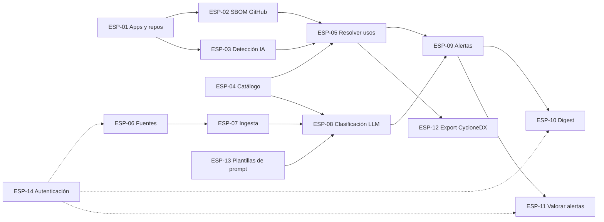

# Especificaciones MVP – Motor de vigilancia tecnológica (IA)
 
Sep 25, 2026 · @Alejo
 
## Introducción
 
El MVP se divide en 14 especificaciones pequeñas agrupadas en 5 épicas: Inventario, Catálogo, Vigilancia, Correlación y Plataforma. Cada especificación entrega una pieza verificable por sí sola y sigue el estándar de especificación del equipo.
 
Supuestos del MVP: configuración por archivos YAML y ejecución por CLI o tareas programadas, salvo el maestro de fuentes de noticias (ESP-06), que se mantiene desde una pantalla de la aplicación web; foco en temas de IA, ecosistemas Python y JavaScript, y repositorios alojados en GitHub.
 

 
Las flechas indican dependencias; en Jira deben registrarse como vínculos "is blocked by". Las flechas discontinuas señalan una dependencia transversal de plataforma (autenticación), no una dependencia funcional dentro de una épica.
 
| ID | Especificación | Épica | Depende de |
| --- | --- | --- | --- |
| ESP-01 | Registrar aplicaciones y repositorios | Inventario | — |
| ESP-02 | Importar SBOM de dependencias desde GitHub | Inventario | ESP-01 |
| ESP-03 | Detectar componentes de IA en el código | Inventario | ESP-01 |
| ESP-04 | Gestionar catálogo de componentes | Catálogo | — |
| ESP-05 | Resolver usos contra el catálogo | Catálogo | ESP-02, ESP-03, ESP-04 |
| ESP-06 | Maestro de fuentes de noticias | Vigilancia | — |
| ESP-07 | Ingerir noticias desde feeds RSS/Atom | Vigilancia | ESP-06 |
| ESP-08 | Clasificar noticias con LLM | Vigilancia | ESP-04, ESP-07, ESP-13 |
| ESP-09 | Generar alertas por correlación | Correlación | ESP-05, ESP-08 |
| ESP-10 | Enviar digest semanal | Correlación | ESP-09 |
| ESP-11 | Valorar alertas (útil / ruido) | Correlación | ESP-09 |
| ESP-12 | Exportar inventario en CycloneDX | Inventario | ESP-05 |
| ESP-13 | Maestro de plantillas de prompt | Plataforma | — |
| ESP-14 | Autenticación y autorización | Plataforma | — |
 
## Épica 1 Inventario
 
Saber qué usa cada aplicación: registro de aplicaciones y repositorios, dependencias obtenidas del SBOM de GitHub, componentes de IA detectados en el código y exportación del inventario en un formato estándar.
 
### ESP-01 Registrar aplicaciones y repositorios

#### Seguimiento

| Campo | Valor |
|---|---|
| **Estado** | 00.TODO |
| **Tiempo invertido** | 0h 0m |
| **Estimación** | — |
| **Relacionado con** | — |
 
#### Historia de usuario
 
**Como** responsable de arquitectura,
 
**Quiero** declarar en un archivo de configuración las aplicaciones y los repositorios de GitHub que las componen,
 
**Para** que el sistema sepa qué inventariar y pueda agrupar los hallazgos por aplicación.
 
#### Descripción de UX
 
**Prototipo:** https://dimly-woven-86209062.figma.site → menú lateral, **Espacio de trabajo › Inventario**. El prototipo es una sola aplicación sin rutas propias por pantalla (mismo enlace para todo el sitio); hay que navegar manualmente hasta esa opción del menú. Los totales generales también asoman en **Espacio de trabajo › Resumen**.

La aplicación web ofrece, además del archivo YAML y el comando CLI, una pantalla de **solo consulta**: **Inventario**, con las aplicaciones y repositorios ya sincronizados y los totales agregados de aplicaciones, repositorios, componentes y elementos pendientes (estos dos últimos los alimentan ESP-02, ESP-03 y ESP-05). El botón **Sincronizar** de esa pantalla dispara el mismo `sync-apps` que el comando CLI, sin más efecto. El alta, la edición o la baja de una aplicación o un repositorio siguen haciéndose únicamente editando `applications.yaml` (Regla 1 y siguientes); esta pantalla no ofrece ningún formulario para ello.
 
#### Descripción funcional
 
**Propósito de la funcionalidad**
 
Disponer de un registro único de aplicaciones y sus repositorios, que es la base de todo el inventario. Sin esta relación no es posible saber a qué aplicación afecta una noticia.
 
**Flujo principal**
 
El usuario edita `applications.yaml` → Ejecuta el comando de sincronización → El sistema valida el archivo → Comprueba el acceso a cada repositorio en GitHub → Crea o actualiza aplicaciones y repositorios en base de datos → Muestra un resumen de altas, cambios y bajas.
 
**Reglas de negocio**
 
- Regla 1: Cada aplicación tiene un identificador único (`key`, en minúsculas, sin espacios) y un nombre visible.
- Regla 2: Una aplicación debe tener al menos un repositorio.
- Regla 3: Cada repositorio se identifica como `owner/nombre` y puede indicar una rama; si no la indica se usa la rama por defecto.
- Regla 4: Un repositorio puede pertenecer a más de una aplicación.
- Regla 5: Los campos opcionales de la aplicación son responsable (email) y criticidad (alta, media, baja; por defecto media).
- Regla 6: Una aplicación o repositorio eliminado del archivo se marca como inactivo, nunca se borra, para conservar el histórico.
**Flujos alternativos o de excepción**
 
Caso 1: Archivo con formato inválido. No se aplica ningún cambio y se indica la línea y el campo con error.
 
Caso 2: Repositorio inaccesible o inexistente. Se registra como "sin acceso", se continúa con el resto y se reporta en el resumen.
 
Caso 3: `key` de aplicación duplicada. No se aplica ningún cambio y se indica la clave duplicada.
 
**Punto de entrada**
 
Comando CLI `sync-apps`, ejecutado manualmente o por tarea programada.
 
**Sistemas / Servicios afectados**
 
API de GitHub (validación de acceso), base de datos del motor.
 
**Persistencia de datos**
 
- Aplicación: key, nombre, responsable, criticidad, estado, fecha de alta y de última sincronización.
- Repositorio: owner, nombre, rama, estado de acceso, fecha de última sincronización.
- Relación aplicación–repositorio (muchos a muchos).
**Notas sobre la interfaz**
 
El resumen en consola muestra totales de altas, modificaciones, inactivaciones y repositorios sin acceso. Cada ejecución de `sync-apps` (manual o programada) queda además registrada en la pantalla web **Sistema › Actividad** (ver ESP-02).
 
**Fuera de alcance**
 
Interfaz gráfica de alta, edición o baja de aplicaciones y repositorios (sigue siendo por archivo YAML y CLI; la aplicación web solo ofrece la pantalla de consulta de la Descripción de UX), descubrimiento automático de repositorios de una organización, repositorios fuera de GitHub.
 
#### Criterios de aceptación
 
```gherkin
Escenario: Alta de una aplicación con dos repositorios
  Dado un applications.yaml válido con la aplicación "chatbot" y los repos "acme/chatbot-api" y "acme/chatbot-web"
  Cuando se ejecuta sync-apps
  Entonces existe la aplicación "chatbot" asociada a ambos repositorios con estado activo
 
Escenario: Repositorio sin acceso
  Dado un repositorio declarado al que el token no tiene acceso
  Cuando se ejecuta sync-apps
  Entonces el repositorio queda con estado "sin acceso"
  Y el resto de repositorios se sincroniza correctamente
 
Escenario: Aplicación retirada del archivo
  Dado que la aplicación "legacy" existía y se elimina del archivo
  Cuando se ejecuta sync-apps
  Entonces "legacy" queda inactiva y su histórico se conserva
```
 
#### Descripción técnica
 
Validación del YAML con un esquema (por ejemplo Pydantic). Autenticación con GitHub App o token de solo lectura (`contents:read`, `metadata:read`). Operación idempotente: ejecutarla dos veces sin cambios no genera modificaciones.
 
### ESP-02 Importar SBOM de dependencias desde GitHub

#### Seguimiento

| Campo | Valor |
|---|---|
| **Estado** | 00.TODO |
| **Tiempo invertido** | 0h 0m |
| **Estimación** | — |
| **Relacionado con** | — |
 
#### Historia de usuario
 
**Como** responsable de arquitectura,
 
**Quiero** obtener automáticamente las dependencias declaradas de cada repositorio registrado,
 
**Para** conocer qué librerías y versiones usa cada aplicación sin revisarlas a mano.
 
#### Descripción de UX
 
**Prototipo:** https://dimly-woven-86209062.figma.site → menú lateral, **Espacio de trabajo › Inventario** (mismos totales que ESP-01) y **Sistema › Actividad**. Enlace único del prototipo, sin rutas por pantalla; hay que navegar hasta cada opción del menú.

La pantalla **Actividad** es compartida por todos los procesos programados o CLI del sistema (`sync-apps`, `import-sbom`, `scan-ai`, `ingest-news`, `classify-news`, `correlate`...): lista, por cada ejecución, el proceso, su resultado y su duración, y agrega los totales del día (procesos ejecutados, correctos, con avisos y tiempo medio). Es de solo lectura y no sustituye el resumen que cada comando ya imprime en consola; `import-sbom` aparece ahí como "Importación SBOM". No hay botón para lanzar una importación manual desde esta pantalla.
 
#### Descripción funcional
 
**Propósito de la funcionalidad**
 
Construir la capa base del inventario reutilizando el SBOM que GitHub ya genera desde el dependency graph, en lugar de parsear manifiestos por nuestra cuenta.
 
**Flujo principal**
 
Se lanza la importación → El sistema recorre los repositorios activos con acceso (ESP-01) → Descarga el SBOM de cada uno → Extrae paquetes, versiones y ecosistema → Guarda una instantánea del inventario del repositorio → Muestra un resumen por repositorio.
 
**Reglas de negocio**
 
- Regla 1: Solo se procesan repositorios activos y con acceso.
- Regla 2: Cada importación genera una instantánea nueva y fechada; las anteriores se conservan.
- Regla 3: Cada dependencia se guarda con su identificador purl, nombre, versión y ecosistema.
- Regla 4: En el MVP solo se procesan los ecosistemas PyPI y npm; el resto se guarda pero se marca como "no soportado".
- Regla 5: Si una dependencia no tiene versión resoluble se guarda con versión "desconocida".
**Flujos alternativos o de excepción**
 
Caso 1: Dependency graph deshabilitado en el repositorio. Se registra el estado "SBOM no disponible" y se continúa con el resto.
 
Caso 2: Límite de peticiones de la API alcanzado. Se pausa hasta el reinicio del límite y se reanuda sin duplicar instantáneas.
 
Caso 3: Error puntual en un repositorio. Se registra el error, no se crea instantánea para ese repositorio y se conserva la anterior como vigente.
 
**Punto de entrada**
 
Comando CLI `import-sbom` (todos los repositorios o uno concreto) y tarea programada diaria.
 
**Sistemas / Servicios afectados**
 
API de GitHub, endpoint del dependency graph (`GET /repos/{owner}/{repo}/dependency-graph/sbom`, formato SPDX).
 
**Persistencia de datos**
 
- Instantánea: repositorio, fecha, commit o rama analizada, estado, número de dependencias.
- Dependencia detectada: instantánea, purl, nombre, versión, ecosistema, directa o transitiva (si el SBOM lo indica).
- Se guarda también el SBOM original en crudo para auditoría.
**Notas sobre la interfaz**
 
El resumen en consola muestra por repositorio: dependencias totales, nuevas y eliminadas respecto a la instantánea anterior.
 
**Fuera de alcance**
 
Detección de modelos y SDKs de IA en el código (ESP-03), vinculación con el catálogo (ESP-05), análisis de vulnerabilidades, alta o relanzamiento manual de una importación desde la interfaz gráfica (la pantalla de Actividad es de solo lectura).
 
#### Criterios de aceptación
 
```gherkin
Escenario: Importación correcta
  Dado el repositorio "acme/chatbot-api" con dependency graph habilitado
  Cuando se ejecuta import-sbom
  Entonces se crea una instantánea con sus dependencias PyPI con purl y versión
 
Escenario: Dependency graph deshabilitado
  Dado un repositorio sin dependency graph
  Cuando se ejecuta import-sbom
  Entonces el repositorio queda con estado "SBOM no disponible"
  Y el resto de repositorios se procesa
 
Escenario: Comparación con la instantánea anterior
  Dado un repositorio con una instantánea previa
  Y se ha añadido la dependencia "langchain"
  Cuando se ejecuta import-sbom
  Entonces el resumen indica 1 dependencia nueva
```
 
#### Descripción técnica
 
Parseo del documento SPDX JSON devuelto por GitHub; el purl se toma de las referencias externas de cada paquete. Control del rate limit mediante las cabeceras `x-ratelimit-remaining` y `x-ratelimit-reset`. Guardar el SBOM crudo en almacenamiento de objetos o columna JSON.
 
### ESP-03 Detectar componentes de IA en el código

#### Seguimiento

| Campo | Valor |
|---|---|
| **Estado** | 00.TODO |
| **Tiempo invertido** | 0h 0m |
| **Estimación** | — |
| **Relacionado con** | — |
 
#### Historia de usuario
 
**Como** responsable de arquitectura,
 
**Quiero** detectar en el código de cada repositorio los modelos de IA, proveedores y endpoints que se utilizan,
 
**Para** tener visibilidad de dependencias de IA que no aparecen en un SBOM tradicional.
 
#### Descripción de UX
 
**Prototipo:** https://dimly-woven-86209062.figma.site → menú lateral, **Espacio de trabajo › Inventario** (los hallazgos suman al total de "Componentes") y **Sistema › Actividad** (descrita en ESP-02), donde también queda registrada cada ejecución de `scan-ai`. Enlace único del prototipo, sin rutas por pantalla.

Es una pantalla de solo consulta; no hay botón para lanzar el escaneo desde la interfaz.
 
#### Descripción funcional
 
**Propósito de la funcionalidad**
 
Un SBOM clásico muestra que se usa la librería `openai`, pero no qué modelo se invoca. Esta historia añade esa capa, que es la que más cambia (deprecaciones y retiradas de modelos) y la que más riesgo operativo genera.
 
**Flujo principal**
 
Se lanza el escaneo → El sistema descarga el contenido de la rama configurada de cada repositorio → Aplica las reglas de detección → Registra cada hallazgo con su evidencia → Guarda los hallazgos asociados a la instantánea del repositorio → Muestra un resumen.
 
**Reglas de negocio**
 
- Regla 1: Las reglas de detección se definen en un archivo de configuración (`ai-detectors.yaml`), no en el código, para poder ampliarlas sin desplegar.
- Regla 2: Cada regla indica tipo de hallazgo (modelo, proveedor, endpoint, variable de entorno), patrón y valor normalizado.
- Regla 3: Tipos de archivo escaneados en el MVP: `.py`, `.js`, `.ts`, `.json`, `.yaml`, `.yml`, `.env.example`, `.toml`.
- Regla 4: Se excluyen carpetas de dependencias y artefactos (`node_modules`, `venv`, `dist`, `build`).
- Regla 5: Cada hallazgo guarda evidencia: ruta del archivo, número de línea y fragmento de máximo 200 caracteres.
- Regla 6: Nunca se almacenan valores de secretos; en variables de entorno solo se guarda el nombre.
- Regla 7: Un mismo valor detectado varias veces en un repositorio genera un único hallazgo con varias evidencias.
**Flujos alternativos o de excepción**
 
Caso 1: Repositorio demasiado grande (más de 500 MB). Se omite y se reporta en el resumen.
 
Caso 2: Archivo binario o con codificación no legible. Se ignora sin detener el escaneo.
 
Caso 3: Patrón inválido en el archivo de reglas. El escaneo no se inicia y se indica la regla con error.
 
**Punto de entrada**
 
Comando CLI `scan-ai` y tarea programada diaria, tras `import-sbom`.
 
**Sistemas / Servicios afectados**
 
API de GitHub (descarga del contenido del repositorio).
 
**Persistencia de datos**
 
- Hallazgo de IA: instantánea, tipo, valor detectado, valor normalizado, regla que lo detectó.
- Evidencia: hallazgo, ruta, línea, fragmento.
**Notas sobre la interfaz**
 
El resumen en consola lista por repositorio los modelos y proveedores detectados.
 
**Fuera de alcance**
 
Análisis semántico del código o del flujo de datos, detección de prompts, modelos locales en ficheros binarios, uso de LLM para detectar, alta o relanzamiento manual del escaneo desde la interfaz gráfica (solo consulta, ver Descripción de UX).
 
#### Criterios de aceptación
 
```gherkin
Escenario: Detección de un modelo en código Python
  Dado un repositorio con la línea model="gpt-4o" en app/llm.py
  Cuando se ejecuta scan-ai
  Entonces existe un hallazgo tipo "modelo" con valor normalizado "openai/gpt-4o"
  Y su evidencia apunta a app/llm.py y la línea correspondiente
 
Escenario: Variable de entorno de proveedor
  Dado un .env.example con ANTHROPIC_API_KEY=xxx
  Cuando se ejecuta scan-ai
  Entonces existe un hallazgo tipo "proveedor" con valor "anthropic"
  Y no se almacena el valor "xxx"
 
Escenario: Exclusión de dependencias
  Dado un archivo dentro de node_modules que menciona "gpt-4o"
  Cuando se ejecuta scan-ai
  Entonces no se genera ningún hallazgo por ese archivo
```
 
#### Descripción técnica
 
Descarga del tarball de la rama vía API o clonado superficial (`--depth 1`). Motor de reglas basado en expresiones regulares. Valorar Semgrep como alternativa si las reglas crecen en complejidad.
 
### ESP-12 Exportar inventario en CycloneDX

#### Seguimiento

| Campo | Valor |
|---|---|
| **Estado** | 00.TODO |
| **Tiempo invertido** | 0h 0m |
| **Estimación** | — |
| **Relacionado con** | — |
 
#### Historia de usuario
 
**Como** responsable de arquitectura,
 
**Quiero** exportar el inventario de una aplicación en formato CycloneDX,
 
**Para** compartirlo con otras herramientas y equipos usando un estándar en lugar de un formato propio.
 
#### Descripción de UX
 
No aplica.
 
#### Descripción funcional
 
**Propósito de la funcionalidad**
 
Generar un SBOM/AIBOM estándar por aplicación que combine dependencias y componentes de IA. Evita la dependencia de un formato propio y permite usar herramientas del ecosistema (por ejemplo, Dependency-Track).
 
**Flujo principal**
 
El usuario ejecuta la exportación indicando la aplicación → El sistema obtiene los usos vigentes de todos sus repositorios → Construye el documento CycloneDX → Lo valida contra el esquema → Lo guarda en la ruta indicada.
 
**Reglas de negocio**
 
- Regla 1: Un documento por aplicación; la aplicación es el componente raíz y cada repositorio un subcomponente.
- Regla 2: Las librerías se exportan como componentes de tipo `library` con su purl y versión.
- Regla 3: Los modelos de IA se exportan como componentes de tipo `machine-learning-model`, con el proveedor como `supplier`.
- Regla 4: Solo se exportan usos resueltos contra el catálogo; los pendientes se omiten y se indica su número en el resumen.
- Regla 5: El documento incluye la fecha de generación y la instantánea de origen de cada repositorio.
- Regla 6: Formato JSON y versión de especificación 1.6.
**Flujos alternativos o de excepción**
 
Caso 1: Aplicación inexistente o inactiva. No se genera documento y se informa.
 
Caso 2: Documento no válido contra el esquema. No se guarda y se muestran los errores de validación.
 
Caso 3: Aplicación sin usos vigentes. Se genera el documento solo con la estructura de aplicación y repositorios, con aviso.
 
**Punto de entrada**
 
Comando CLI `export-bom <aplicación> --output <ruta>`.
 
**Sistemas / Servicios afectados**
 
Ninguno externo.
 
**Persistencia de datos**
 
No persiste datos nuevos en base de datos; solo genera el archivo.
 
**Notas sobre la interfaz**
 
El resumen muestra el número de componentes exportados por tipo y los omitidos.
 
**Fuera de alcance**
 
Formato SPDX, exportación de vulnerabilidades (VEX), publicación automática en Dependency-Track, firma del documento.
 
#### Criterios de aceptación
 
```gherkin
Escenario: Exportación de una aplicación con modelos y librerías
  Dada la aplicación "chatbot" que usa langchain 0.1.20 y gpt-4o
  Cuando se ejecuta export-bom chatbot
  Entonces se genera un JSON CycloneDX 1.6 válido
  Y langchain aparece como "library" con su purl y versión
  Y gpt-4o aparece como "machine-learning-model" con proveedor OpenAI
 
Escenario: Usos pendientes omitidos
  Dada una aplicación con 2 elementos no resueltos
  Cuando se exporta
  Entonces el documento no los incluye
  Y el resumen indica 2 elementos omitidos
```
 
#### Descripción técnica
 
Librería `cyclonedx-python-lib` para construir y validar el documento. Usa la consulta `component_usage_current` de ESP-05.
 
## Épica 2 Catálogo
 
Vocabulario común del sistema: componentes de IA con identificador canónico y alias, y resolución de los usos del inventario contra ese catálogo.
 
### ESP-04 Gestionar catálogo de componentes

#### Seguimiento

| Campo | Valor |
|---|---|
| **Estado** | 00.TODO |
| **Tiempo invertido** | 0h 0m |
| **Estimación** | — |
| **Relacionado con** | — |
 
#### Historia de usuario
 
**Como** responsable de vigilancia tecnológica,
 
**Quiero** mantener un catálogo de componentes de IA con un identificador canónico y sus alias,
 
**Para** que inventario y noticias hablen del mismo componente con el mismo nombre.
 
#### Descripción de UX
 
**Prototipo:** https://dimly-woven-86209062.figma.site → menú lateral, **Espacio de trabajo › Catálogo**. Enlace único del prototipo, sin rutas por pantalla.

Pantalla de consulta con los totales del catálogo (librerías, modelos, proveedores y elementos sin resolver, estos últimos de ESP-05) y el listado de componentes. Incluye un botón **Nuevo componente** que, en el diseño, abriría un formulario de alta equivalente a añadir una entrada en `catalog.yaml` (mismas Reglas de negocio y misma validación que `sync-catalog`); en este MVP ese botón queda sin implementar (ver Fuera de alcance) y el alta real se sigue haciendo por archivo y comando CLI.
 
#### Descripción funcional
 
**Propósito de la funcionalidad**
 
El catálogo es el vocabulario común del sistema. Sin él, "GPT-4o", "gpt-4o-2024-08-06" y "OpenAI GPT 4o" serían tres cosas distintas y la correlación fallaría.
 
**Flujo principal**
 
El usuario edita `catalog.yaml` → Ejecuta `sync-catalog` → El sistema valida el archivo → Crea o actualiza componentes y alias → Muestra un resumen de cambios.
 
**Reglas de negocio**
 
- Regla 1: Tipos de componente admitidos: librería, modelo, proveedor.
- Regla 2: El identificador canónico es obligatorio y único. Librerías: purl sin versión (`pkg:pypi/langchain`). Modelos: `model:<proveedor>/<modelo>`. Proveedores: `provider:<nombre>`.
- Regla 3: Un modelo debe referenciar a un proveedor existente en el catálogo.
- Regla 4: Cada componente puede tener varios alias; un alias no puede pertenecer a dos componentes.
- Regla 5: La comparación de alias no distingue mayúsculas, espacios ni guiones.
- Regla 6: Campos opcionales: nombre visible, URL de documentación, familia (por ejemplo "gpt-4o" agrupa sus versiones fechadas).
- Regla 7: Un componente eliminado del archivo se marca como inactivo si tiene usos o noticias asociadas.
**Flujos alternativos o de excepción**
 
Caso 1: Alias duplicado entre componentes. No se aplica ningún cambio y se indican ambos componentes.
 
Caso 2: Modelo con proveedor inexistente. No se aplica ningún cambio y se indica el modelo afectado.
 
Caso 3: Identificador con formato inválido. No se aplica ningún cambio y se indica el campo.
 
**Punto de entrada**
 
Comando CLI `sync-catalog`.
 
**Sistemas / Servicios afectados**
 
Base de datos del motor.
 
**Persistencia de datos**
 
- Componente: identificador canónico, tipo, nombre visible, proveedor (si es modelo), familia, URL de documentación, estado.
- Alias: componente, texto del alias, texto normalizado.
**Notas sobre la interfaz**
 
Se entrega un catálogo semilla con unos 30 componentes: SDKs (openai, anthropic, langchain, llama-index, transformers), proveedores principales y sus modelos más usados.
 
**Fuera de alcance**
 
Versionado del catálogo, sugerencia automática de nuevos componentes, alta o edición de componentes desde la interfaz gráfica (el botón **Nuevo componente** del prototipo no queda operativo en este MVP; el alta sigue siendo por archivo y CLI). La aplicación web solo ofrece la pantalla de consulta de la Descripción de UX.
 
#### Criterios de aceptación
 
```gherkin
Escenario: Alta de un modelo con alias
  Dado un catalog.yaml con el modelo "model:openai/gpt-4o" y alias "GPT-4o" y "gpt-4o-2024-08-06"
  Cuando se ejecuta sync-catalog
  Entonces el modelo existe asociado al proveedor "provider:openai" con ambos alias
 
Escenario: Alias en conflicto
  Dado que el alias "sonnet" está en dos componentes distintos
  Cuando se ejecuta sync-catalog
  Entonces no se aplica ningún cambio
  Y se informa del conflicto indicando ambos componentes
 
Escenario: Normalización de alias
  Dado el alias "GPT-4o" registrado
  Cuando se busca el texto "gpt 4o"
  Entonces se resuelve al componente "model:openai/gpt-4o"
```
 
#### Descripción técnica
 
Función de normalización compartida (minúsculas, eliminar espacios y guiones) reutilizada por ESP-05 y ESP-08. Índice único sobre el alias normalizado.
 
### ESP-05 Resolver usos contra el catálogo

#### Seguimiento

| Campo | Valor |
|---|---|
| **Estado** | 00.TODO |
| **Tiempo invertido** | 0h 0m |
| **Estimación** | — |
| **Relacionado con** | — |
 
#### Historia de usuario
 
**Como** responsable de arquitectura,
 
**Quiero** que las dependencias y hallazgos de IA de cada repositorio se vinculen a componentes del catálogo,
 
**Para** saber, por componente, qué aplicaciones y repositorios lo usan y en qué versión.
 
#### Descripción de UX
 
**Prototipo:** https://dimly-woven-86209062.figma.site. Esta especificación no tiene pantalla propia: sus resultados asoman como el contador **"Pendientes"** de la pantalla **Inventario** (ESP-01) y **"Sin resolver"** de la pantalla **Catálogo** (ESP-04). El detalle de cada pendiente (`list-unresolved`) sigue siendo solo por CLI.
 
#### Descripción funcional
 
**Propósito de la funcionalidad**
 
Convertir los datos en bruto de ESP-02 y ESP-03 en un inventario normalizado: la tabla de usos, que es la que se cruzará con las noticias.
 
**Flujo principal**
 
Tras cada importación o escaneo → El sistema toma las dependencias y hallazgos de la última instantánea → Busca cada uno en el catálogo por identificador o alias → Crea o actualiza el uso correspondiente → Registra los elementos no resueltos → Muestra un resumen.
 
**Reglas de negocio**
 
- Regla 1: Una dependencia se resuelve por su purl sin versión; si no coincide, por alias.
- Regla 2: Un hallazgo de IA se resuelve por su valor normalizado contra los alias.
- Regla 3: Un uso vincula repositorio, componente, versión (si aplica) y origen (SBOM o escaneo).
- Regla 4: Solo se consideran vigentes los usos de la última instantánea correcta de cada repositorio.
- Regla 5: Los elementos no resueltos se guardan en una lista de pendientes, sin generar uso.
- Regla 6: Un pendiente se resuelve automáticamente en la siguiente ejecución si se añade al catálogo el alias correspondiente.
**Flujos alternativos o de excepción**
 
Caso 1: Elemento sin coincidencia. Se añade a pendientes con el número de repositorios donde aparece.
 
Caso 2: Repositorio sin instantánea correcta. No se modifican sus usos vigentes.
 
**Punto de entrada**
 
Se ejecuta al final de `import-sbom` y `scan-ai`, y a demanda con `resolve-usages`.
 
**Sistemas / Servicios afectados**
 
Base de datos del motor.
 
**Persistencia de datos**
 
- Uso: repositorio, componente, versión, origen, instantánea, referencia a la evidencia.
- Pendiente: texto original, tipo, repositorios donde aparece, primera y última vez visto.
**Notas sobre la interfaz**
 
Comando `list-unresolved` que muestra los pendientes ordenados por número de repositorios, para priorizar qué añadir al catálogo.
 
**Fuera de alcance**
 
Resolución asistida por LLM, sugerencia automática de alias.
 
#### Criterios de aceptación
 
```gherkin
Escenario: Resolución de una dependencia por purl
  Dada una dependencia pkg:pypi/langchain@0.1.20 en "acme/chatbot-api"
  Y el componente "pkg:pypi/langchain" en el catálogo
  Cuando se ejecuta resolve-usages
  Entonces existe un uso de langchain versión 0.1.20 en "acme/chatbot-api" con origen SBOM
 
Escenario: Elemento no resuelto
  Dado un hallazgo con valor "mistral-large" que no está en el catálogo
  Cuando se ejecuta resolve-usages
  Entonces aparece en list-unresolved
  Y no se crea ningún uso
 
Escenario: Consulta por componente
  Dado que gpt-4o se usa en dos repositorios de la aplicación "chatbot"
  Cuando se consultan los usos de "model:openai/gpt-4o"
  Entonces se obtienen ambos repositorios y la aplicación "chatbot"
```
 
#### Descripción técnica
 
Reutiliza la función de normalización de ESP-04. Vista o consulta `component_usage_current` que une uso, repositorio y aplicación, base de ESP-09 y ESP-12.
 
## Épica 3 Vigilancia
 
Saber qué pasa fuera: mantenimiento de las fuentes de noticias, ingesta periódica de sus entradas y clasificación de las noticias con LLM.
 
### ESP-06 Maestro de fuentes de noticias

#### Seguimiento

| Campo | Valor |
|---|---|
| **Estado** | 00.TODO |
| **Tiempo invertido** | 0h 0m |
| **Estimación** | — |
| **Relacionado con** | — |

#### Historia de usuario

**Como** responsable de vigilancia tecnológica,

**Quiero** crear, consultar, modificar y eliminar las fuentes de noticias de proveedores y productos que quiero seguir desde una pantalla de mantenimiento,

**Para** que el sistema sepa de dónde obtener novedades y con qué frecuencia.

#### Descripción de UX

**Prototipo:** https://dimly-woven-86209062.figma.site → menú lateral, sección **Maestros › Fuentes de noticias**. El prototipo es una sola aplicación sin rutas propias por pantalla, así que el enlace es el mismo para todo el sitio; hay que navegar manualmente hasta esa opción del menú.

El maestro se abre desde el menú **Maestros › Fuentes de noticias** y tiene tres vistas: listado, formulario y detalle.

**Listado de fuentes**

- Tabla paginada con las columnas Identificador, Nombre, Tipo, Frecuencia (h), Estado, Activa y Última modificación.
- Búsqueda libre por identificador, nombre o URL.
- Filtros por tipo, estado (Pendiente de validar / Operativa / En error) y activa (sí/no).
- Ordenación por cualquier columna; por defecto, por nombre.
- El estado se muestra como etiqueta de color: gris para pendiente, verde para operativa y rojo para en error. Las fuentes desactivadas se muestran atenuadas.
- Botón **Nueva fuente**.
- Acciones por fila: Ver detalle, Editar, Activar/Desactivar, Validar ahora y Eliminar.

**Formulario de alta y edición**

| Campo | Control | Obligatorio | Observaciones |
| --- | --- | --- | --- |
| Identificador | Texto | Sí | Formato slug (`langchain-releases`). No editable una vez creada la fuente. |
| Nombre | Texto | Sí | Máx. 200 caracteres. |
| URL | Texto | Sí | http/https. |
| Tipo | Selector | Sí | RSS/Atom, Releases de GitHub o Versiones de PyPI. |
| Frecuencia de consulta (horas) | Numérico | Sí | Por defecto 24. Rango de 1 a 720. |
| Activa | Interruptor | Sí | Por defecto activa. |
| Filtro de inclusión | Texto | No | Expresión regular sobre el título. Si se informa, solo se ingieren las entradas que coinciden. |
| Filtro de exclusión | Texto | No | Expresión regular sobre el título. Se descartan las entradas que coinciden (por ejemplo, `^VSCode Extension` en las releases de Angular). |
| Incluir prereleases | Interruptor | No | Solo visible para Releases de GitHub y Versiones de PyPI. Por defecto desactivado. |

- Botón **Probar feed**: valida la URL sin guardar. Si la validación es correcta, muestra el título del feed, el número de entradas, cuántas pasan los filtros y la fecha de la última entrada; si falla, muestra el error obtenido.
- Botones **Guardar** y **Cancelar**. Los errores de validación se muestran junto a cada campo.

**Detalle de la fuente**

Muestra todos los campos en modo lectura, el estado y los datos de auditoría (fecha y usuario de alta y de última modificación). Desde esta vista se accede a Editar, Validar ahora, Activar/Desactivar y Eliminar.

Incluye además un bloque **Prompt de clasificación** que indica qué plantilla se le aplica (la propia de la fuente o la genérica de la categoría "Vigilancia") con un enlace **Personalizar** que abre el maestro de plantillas de prompt (ESP-13) con la categoría "Vigilancia" y el identificador de esa fuente ya propuestos.

#### Descripción funcional

**Propósito de la funcionalidad**

Centralizar y mantener desde un maestro con interfaz gráfica las fuentes vigiladas, que son la base de la ingesta de noticias (ESP-07).

**Flujo principal (alta)**

El usuario pulsa **Nueva fuente** → Completa el formulario → Pulsa **Guardar** → El sistema valida los campos → Comprueba que la URL responde y es un feed válido → Crea la fuente con estado "Operativa" → Muestra un mensaje de confirmación.

**Flujos secundarios**

- **Consulta:** el usuario busca y filtra en el listado y abre el detalle de una fuente.
- **Modificación:** el usuario edita una fuente y guarda. Si cambia la URL o el tipo, el sistema vuelve a validar el feed y actualiza el estado.
- **Activar/Desactivar:** cambia el campo `enabled`. Las fuentes desactivadas no se consultan, pero se conservan.
- **Validar ahora:** fuerza la validación del feed. Si es correcta, la fuente pasa a "Operativa"; si falla, pasa a "En error".
- **Personalizar el prompt:** desde el detalle de la fuente, el usuario crea o edita la plantilla de la categoría "Vigilancia" con identificador igual al de la fuente (ESP-13). Si no la crea, la fuente usa la plantilla genérica de esa categoría.
- **Eliminación:** el sistema pide confirmación y solo elimina la fuente si no tiene noticias asociadas (Regla 8).

**Reglas de negocio**

- Regla 1: Los campos obligatorios son identificador, nombre, URL, tipo y frecuencia.
- Regla 2: El identificador es único, tiene formato slug (minúsculas, números y guiones) y no se puede modificar después del alta.
- Regla 3: La URL es única sin distinguir mayúsculas; no puede haber dos fuentes con la misma URL.
- Regla 4: Los tipos admitidos en el MVP son:
  - **RSS/Atom** (`rss_atom`): cualquier feed RSS 2.0 o Atom.
  - **Releases de GitHub** (`github_releases`): se consumen como Atom y su URL debe seguir el patrón `https://github.com/{owner}/{repo}/releases.atom`.
  - **Versiones de PyPI** (`pypi_releases`): su URL debe seguir el patrón `https://pypi.org/rss/project/{paquete}/releases.xml`. El paquete se obtiene de la URL, por lo que se crea una fuente por paquete.

  El tipo determina el adaptador que aplica la ingesta (ESP-07).
- Regla 5: La frecuencia de consulta se expresa en horas, entre 1 y 720; por defecto es 24.
- Regla 6: Una fuente puede desactivarse sin borrarla (campo `enabled`).
- Regla 7: La fuente tiene tres estados posibles:
  - "Pendiente de validar": aún no se ha validado.
  - "Operativa": la última validación fue correcta.
  - "En error": la última validación falló.

  El estado se actualiza al guardar y con Validar ahora.
- Regla 8: No se puede eliminar una fuente con noticias asociadas; en ese caso el sistema propone desactivarla.
- Regla 9: Cada alta y cada modificación registran la fecha y el usuario que la realizó.
- Regla 10: La aplicación realiza todas las validaciones de estas reglas; la base de datos no contiene lógica.
- Regla 11: Los filtros de inclusión y exclusión son opcionales, deben ser expresiones regulares válidas (máx. 500 caracteres) y se evalúan sobre el título de la entrada sin distinguir mayúsculas. Si hay ambos, primero se aplica la inclusión y después la exclusión. Los filtros se aplican en la ingesta (ESP-07); cambiarlos no vuelve a validar el feed.
- Regla 12: La opción "Incluir prereleases" solo aplica a Releases de GitHub y Versiones de PyPI; en RSS/Atom se ignora. Por defecto las prereleases (alpha, beta, rc, dev, next) no se ingieren.

**Flujos alternativos o de excepción**

Caso 1: La URL no responde o no es un feed válido al guardar. El sistema muestra una advertencia con el error y ofrece dos opciones: *Guardar igualmente*, con lo que la fuente queda "En error", o *Corregir*, que vuelve al formulario.

Caso 2: Identificador o URL duplicados. No se guarda y se muestra el error en el campo correspondiente.

Caso 3: Un campo tiene formato incorrecto o un valor fuera de rango (incluidas una URL que no sigue el patrón de su tipo o una expresión regular no válida en los filtros). No se guarda y se muestra el error junto al campo.

Caso 4: Eliminación de una fuente con noticias asociadas. No se elimina, se informa del número de noticias y se ofrece desactivarla.

**Punto de entrada**

Menú **Maestros › Fuentes de noticias** de la aplicación web.

**Sistemas / Servicios afectados**

Sitios web de las fuentes (validación HTTP del feed).

**Persistencia de datos**

- Fuente: identificador, nombre, URL, tipo, frecuencia, activa, filtros de inclusión y exclusión, incluir prereleases, estado y auditoría (fecha y usuario de alta y de última modificación).

**Notas sobre la interfaz**

Se entregan cargadas de 10 a 15 fuentes semilla mediante un script de datos iniciales. Incluyen, como mínimo, las fuentes de referencia:

| Identificador | Tipo | URL | Filtros |
| --- | --- | --- | --- |
| `azure-updates` | RSS/Atom | `https://www.microsoft.com/releasecommunications/api/v2/azure/rss` | — |
| `huggingface-blog` | RSS/Atom | `https://huggingface.co/blog/feed.xml` | — |
| `pypi-{paquete}` (una por paquete del catálogo semilla) | Versiones de PyPI | `https://pypi.org/rss/project/{paquete}/releases.xml` | Sin prereleases |
| `dotnet-blog` | RSS/Atom | `https://devblogs.microsoft.com/dotnet/feed/` | — |
| `angular-releases` | Releases de GitHub | `https://github.com/angular/angular/releases.atom` | Exclusión `^VSCode Extension`, sin prereleases |

El resto son blogs y changelogs de proveedores de IA y páginas de deprecación de modelos que ofrezcan feed. Quedan en estado "Pendiente de validar" hasta su primera validación y se mantienen desde el maestro como cualquier otra fuente.

**Fuera de alcance**

- Relación de fuentes con componentes del catálogo (se detallará en otra especificación).
- Mantenimiento de las plantillas de prompt (maestro propio en ESP-13); este maestro solo enlaza a él.
- Seguimiento de fallos consecutivos y resultado de las consultas periódicas (dominio de la ingesta, ESP-07).
- Scraping de páginas HTML sin feed.
- Fuentes que requieren autenticación.
- Redes sociales.
- Newsletters por email.
- Importación o exportación masiva de fuentes.

#### Criterios de aceptación

```gherkin
Escenario: Alta de fuente de releases de GitHub
  Dado que el usuario está en el formulario "Nueva fuente"
  Y completa identificador "langchain-releases", tipo "Releases de GitHub"
    y URL "https://github.com/langchain-ai/langchain/releases.atom"
  Cuando pulsa "Guardar"
  Entonces la fuente se crea activa con estado "Operativa"
  Y aparece en el listado de fuentes

Escenario: Alta de fuente de versiones de PyPI
  Dado que el usuario está en el formulario "Nueva fuente"
  Y completa identificador "pypi-langchain", tipo "Versiones de PyPI"
    y URL "https://pypi.org/rss/project/langchain/releases.xml"
  Cuando pulsa "Guardar"
  Entonces la fuente se crea activa con estado "Operativa"
  Y con "Incluir prereleases" desactivado

Escenario: URL que no sigue el patrón de su tipo
  Dado que el usuario elige el tipo "Versiones de PyPI"
  Y completa la URL "https://pypi.org/project/langchain/"
  Cuando pulsa "Guardar"
  Entonces el sistema no guarda
  Y muestra el patrón esperado en el campo URL

Escenario: Filtro con expresión regular no válida
  Dado que el usuario completa el filtro de exclusión "^VSCode (Extension"
  Cuando pulsa "Guardar"
  Entonces el sistema no guarda
  Y muestra el error en el campo filtro de exclusión

Escenario: Alta de fuente con URL inválida
  Dado que el usuario da de alta una fuente cuya URL devuelve error 404
  Cuando pulsa "Guardar"
  Entonces el sistema muestra una advertencia con el error
  Y si elige "Guardar igualmente" la fuente queda en estado "En error"

Escenario: Identificador duplicado
  Dado que ya existe la fuente "openai-blog"
  Cuando el usuario intenta crear otra fuente con identificador "openai-blog"
  Entonces el sistema no guarda
  Y muestra el error "El identificador ya existe" en el campo identificador

Escenario: Modificación de la URL
  Dada la fuente "openai-blog" en estado "En error"
  Cuando el usuario cambia la URL por una válida y pulsa "Guardar"
  Entonces el sistema valida el nuevo feed
  Y la fuente pasa a estado "Operativa"

Escenario: Desactivar una fuente
  Dada la fuente activa "anthropic-news"
  Cuando el usuario pulsa "Desactivar"
  Entonces la fuente queda con activa = no
  Y no se incluye en las consultas programadas

Escenario: Eliminar fuente sin noticias
  Dada la fuente "test-feed" sin noticias asociadas
  Cuando el usuario pulsa "Eliminar" y confirma
  Entonces la fuente se elimina

Escenario: Eliminar fuente con noticias
  Dada la fuente "openai-blog" con noticias asociadas
  Cuando el usuario pulsa "Eliminar"
  Entonces el sistema no la elimina
  Y ofrece desactivarla

Escenario: Consulta con filtros
  Dadas varias fuentes con distintos estados
  Cuando el usuario filtra por estado "En error"
  Entonces el listado muestra solo las fuentes en ese estado
```

#### Descripción técnica

**Validación del feed**

- Se valida con `feedparser`. El feed es válido si responde HTTP 2xx, `bozo` no indica un error fatal y contiene `feed.title` o al menos una entrada.
- Timeout de 10 segundos y hasta 5 redirecciones.
- User-Agent identificable (por ejemplo `VigilanciaTecBot/1.0 (+url-de-contacto)`) y respeto de `robots.txt`; si `robots.txt` prohíbe el acceso, se trata como error de validación. El User-Agent de bot es obligatorio y no debe sustituirse por uno de navegador: algunas fuentes, como Azure Updates, devuelven 403 a los User-Agent de navegador. La ingesta (ESP-07) usa el mismo.
- Además de la validación del feed, se comprueba que la URL cumple el patrón de su tipo (Regla 4) y que los filtros compilan como expresión regular (Regla 11).
- La validación se ejecuta en el backend. *Probar feed* llama a un endpoint que no persiste nada.

**API (backend del maestro)**

| Método | Ruta | Uso |
| --- | --- | --- |
| GET | `/api/news-sources` | Listado con paginación, filtros y búsqueda |
| GET | `/api/news-sources/{id}` | Detalle |
| POST | `/api/news-sources` | Alta |
| PUT | `/api/news-sources/{id}` | Modificación |
| PATCH | `/api/news-sources/{id}/enabled` | Activar/Desactivar |
| POST | `/api/news-sources/{id}/validate` | Validar ahora |
| POST | `/api/news-sources/test-feed` | Probar feed sin guardar |
| DELETE | `/api/news-sources/{id}` | Eliminación (409 si tiene noticias asociadas) |

**Modelo de datos en PostgreSQL**

Tabla `news_source`:

| Columna | Tipo | Nulo | Por defecto | Descripción |
| --- | --- | --- | --- | --- |
| `id` | `UUID` | No | `gen_random_uuid()` | Clave primaria técnica |
| `code` | `VARCHAR(64)` | No | — | Identificador de negocio (slug), inmutable |
| `name` | `VARCHAR(200)` | No | — | Nombre visible |
| `url` | `VARCHAR(2048)` | No | — | URL del feed |
| `source_type` | `VARCHAR(20)` | No | — | `rss_atom`, `github_releases` o `pypi_releases` |
| `fetch_frequency_hours` | `INTEGER` | No | `24` | Frecuencia de consulta (1–720) |
| `enabled` | `BOOLEAN` | No | `TRUE` | Fuente activa o desactivada |
| `include_pattern` | `VARCHAR(500)` | Sí | — | Filtro de inclusión (expresión regular sobre el título) |
| `exclude_pattern` | `VARCHAR(500)` | Sí | — | Filtro de exclusión (expresión regular sobre el título) |
| `include_prereleases` | `BOOLEAN` | No | `FALSE` | Ingerir prereleases (solo `github_releases` y `pypi_releases`) |
| `status` | `VARCHAR(20)` | No | `'pending'` | `pending` (Pendiente de validar), `ok` (Operativa) o `error` (En error) |
| `created_at` | `TIMESTAMPTZ` | No | `now()` | Fecha de alta |
| `created_by` | `VARCHAR(100)` | No | — | Usuario que la creó |
| `updated_at` | `TIMESTAMPTZ` | No | `now()` | Fecha de última modificación |
| `updated_by` | `VARCHAR(100)` | No | — | Usuario que la modificó |

```sql
CREATE TABLE news_source (
    id                     UUID          PRIMARY KEY DEFAULT gen_random_uuid(),
    code                   VARCHAR(64)   NOT NULL,
    name                   VARCHAR(200)  NOT NULL,
    url                    VARCHAR(2048) NOT NULL,
    source_type            VARCHAR(20)   NOT NULL,
    fetch_frequency_hours  INTEGER       NOT NULL DEFAULT 24,
    enabled                BOOLEAN       NOT NULL DEFAULT TRUE,
    include_pattern        VARCHAR(500),
    exclude_pattern        VARCHAR(500),
    include_prereleases    BOOLEAN       NOT NULL DEFAULT FALSE,
    status                 VARCHAR(20)   NOT NULL DEFAULT 'pending',
    created_at             TIMESTAMPTZ   NOT NULL DEFAULT now(),
    created_by             VARCHAR(100)  NOT NULL,
    updated_at             TIMESTAMPTZ   NOT NULL DEFAULT now(),
    updated_by             VARCHAR(100)  NOT NULL
);
```

**Notas de implementación**

### ESP-07 Ingerir noticias desde feeds RSS/Atom

#### Seguimiento

| Campo | Valor |
|---|---|
| **Estado** | 00.TODO |
| **Tiempo invertido** | 0h 0m |
| **Estimación** | — |
| **Relacionado con** | — |
 
#### Historia de usuario
 
**Como** responsable de vigilancia tecnológica,
 
**Quiero** que el sistema descargue periódicamente las entradas nuevas de cada fuente,
 
**Para** disponer de un histórico de noticias sin duplicados listo para analizar.
 
#### Descripción de UX
 
No aplica.
 
#### Descripción funcional
 
**Propósito de la funcionalidad**
 
Alimentar el sistema con noticias frescas de forma automática y sin duplicados, guardando el texto necesario para que el LLM pueda clasificarlas.
 
**Flujo principal**
 
La tarea programada se ejecuta → Selecciona las fuentes activas cuya última consulta supera su frecuencia → Descarga cada feed → Normaliza las entradas al modelo común → Aplica el adaptador del tipo de fuente → Aplica los filtros de la fuente → Detecta las entradas nuevas → Obtiene el contenido de cada entrada cuando el feed no lo trae → Guarda la noticia con estado "pendiente de clasificar" → Actualiza el estado de consulta de la fuente.

**Cómo se interpretan las entradas**

La ingesta no necesita reglas de mapeo por fuente. RSS 2.0 y Atom son formatos estándar: cualquier feed es una lista de entradas (`<item>` o `<entry>`) con título, enlace, identificador, fecha, resumen o contenido y categorías, y `feedparser` los convierte a un único modelo común. Lo que varía entre fuentes es cuánta información trae cada entrada y cuánto significado tiene su estructura. Eso se resuelve en tres capas:

1. **Normalización (genérica):** toda entrada se convierte al modelo común, sea cual sea la fuente.
2. **Adaptador por tipo de fuente:** en los tipos en que la estructura ya dice qué ha pasado (versiones de PyPI y releases de GitHub), se extraen datos estructurados sin interpretar el texto.
3. **Enriquecimiento:** si la entrada trae poco texto, se descarga la página y se extrae el texto principal.

La interpretación del significado (componente afectado, tipo de evento, severidad, fechas) no se hace aquí: es responsabilidad del LLM en ESP-08.

**Reglas de negocio**

- Regla 1: Una noticia se identifica por su URL canónica; si el feed ofrece `guid` o `id`, se usa también para deduplicar. Algunas fuentes, como PyPI, no lo ofrecen.
- Regla 2: Si el contenido del feed tiene menos de 500 caracteres, se descarga la página de la noticia y se extrae el texto principal. No se aplica a las Versiones de PyPI, cuya página no describe la versión.
- Regla 3: El texto guardado se limita a 20.000 caracteres.
- Regla 4: En la primera ejecución de una fuente solo se importan las entradas de los últimos 30 días.
- Regla 5: Toda noticia nueva queda en estado "pendiente de clasificar".
- Regla 6: Cada consulta registra en el estado de consulta de la fuente la fecha, el resultado y, si falla, el error. Una consulta correcta pone a cero los fallos consecutivos y una fallida los incrementa. Con 5 o más fallos consecutivos la fuente se destaca en el resumen de ejecución. Este estado es de la ingesta y no modifica el estado de validación del maestro (ESP-06, Regla 7).
- Regla 7: Toda entrada se normaliza al modelo común: identificador, título, enlace, fecha de publicación, contenido y categorías. Si hay varios campos de contenido, se toma el más completo (`content` o `content:encoded` antes que `summary` o `description`).
- Regla 8: Adaptadores por tipo de fuente:
  - **RSS/Atom:** sin adaptador; solo normalización.
  - **Releases de GitHub:** la versión se obtiene del tag de la release (último segmento de `/releases/tag/{tag}`, sin prefijo `v`). Es prerelease si la versión incluye un sufijo `alpha`, `beta`, `rc` o `next`.
  - **Versiones de PyPI:** el paquete se obtiene de la URL de la fuente y la versión, del título de la entrada. Se generan como datos estructurados el componente sugerido `pkg:pypi/{paquete}`, la versión y el tipo de evento sugerido "nueva versión". Es prerelease según PEP 440 (`a`, `b`, `rc`, `dev`).
- Regla 9: Los filtros de la fuente (ESP-06, Reglas 11 y 12) se aplican tras el adaptador. Las entradas descartadas no se guardan y solo se cuentan en el resumen.
- Regla 10: Las categorías del feed se guardan con la noticia y se pasan a la clasificación (ESP-08) como pistas. Por ejemplo, Azure Updates indica en ellas si la entrada es una retirada, una preview o una disponibilidad general.
- Regla 11: Todas las peticiones (feed y páginas) usan el User-Agent de bot definido en ESP-06 y respetan `robots.txt`.

**Flujos alternativos o de excepción**

Caso 1: Feed no disponible. Se registra el error, se incrementan los fallos consecutivos de la fuente y se reintenta en la siguiente ejecución.

Caso 2: Página de la noticia no accesible. Se guarda la noticia con el contenido del feed y se marca "contenido parcial".

Caso 3: Entrada sin fecha. Se usa la fecha de ingesta.

Caso 4: El adaptador no puede extraer la versión (tag o título sin formato de versión). La entrada se guarda sin datos estructurados, como si fuera RSS/Atom, y se registra un aviso.

Caso 5: El feed responde `304 Not Modified`. La consulta cuenta como correcta y no se procesa ninguna entrada.
 
**Punto de entrada**
 
Tarea programada cada hora y comando CLI `ingest-news` (todas las fuentes o una).
 
**Sistemas / Servicios afectados**
 
Sitios web de las fuentes.
 
**Persistencia de datos**
 
- Noticia: fuente, URL canónica, guid, título, fecha de publicación, fecha de ingesta, texto, categorías, indicador de contenido parcial, estado y, si el adaptador los genera, datos estructurados (componente sugerido, versión, tipo de evento sugerido, indicador de prerelease).
- Estado de consulta de la fuente: fuente, fecha de la última consulta, fecha de la última consulta correcta, último error, fallos consecutivos, `ETag` y `Last-Modified` recibidos.

**Notas sobre la interfaz**

El resumen de ejecución muestra, por fuente, las noticias nuevas, las entradas descartadas por filtros y las fuentes con error, destacando las que acumulan 5 o más fallos consecutivos. Cada ejecución de `ingest-news` también queda registrada, como "Ingesta de noticias", en la pantalla web **Sistema › Actividad** (ESP-02).
 
**Fuera de alcance**
 
Clasificación (ESP-08), traducción, detección de noticias duplicadas entre fuentes distintas.
 
#### Criterios de aceptación
 
```gherkin
Escenario: Ingesta sin duplicados
  Dada una fuente con 3 entradas ya ingeridas y 2 nuevas en el feed
  Cuando se ejecuta ingest-news
  Entonces se crean exactamente 2 noticias en estado "pendiente de clasificar"
 
Escenario: Contenido corto en el feed
  Dada una entrada cuyo resumen tiene 120 caracteres
  Cuando se ingiere
  Entonces se descarga la página y se guarda su texto principal
 
Escenario: Primera ejecución de una fuente
  Dada una fuente nueva con entradas de los últimos 6 meses
  Cuando se ejecuta ingest-news por primera vez
  Entonces solo se importan las entradas de los últimos 30 días

Escenario: Versión nueva en PyPI
  Dada la fuente "pypi-langchain" de tipo "Versiones de PyPI"
  Y una entrada nueva con título "1.4.2"
  Cuando se ejecuta ingest-news
  Entonces se crea una noticia con componente sugerido "pkg:pypi/langchain",
    versión "1.4.2" y tipo de evento sugerido "nueva versión"
  Y no se descarga la página de la entrada

Escenario: Prerelease descartada
  Dada una fuente de Versiones de PyPI sin "Incluir prereleases"
  Y una entrada nueva con título "1.4.0a4"
  Cuando se ejecuta ingest-news
  Entonces no se crea ninguna noticia
  Y el resumen cuenta 1 entrada descartada

Escenario: Filtro de exclusión en releases de GitHub
  Dada la fuente "angular-releases" con filtro de exclusión "^VSCode Extension"
  Y una entrada nueva con título "VSCode Extension: 22.2.0"
  Cuando se ejecuta ingest-news
  Entonces no se crea ninguna noticia para esa entrada

Escenario: Entrada sin contenido en el feed
  Dada la fuente "huggingface-blog", cuyas entradas solo traen título, enlace y fecha
  Cuando se ingiere una entrada nueva
  Entonces se descarga la página y se guarda su texto principal

Escenario: Categorías como pistas
  Dada una entrada de "azure-updates" con la categoría "Retirements"
  Cuando se ingiere
  Entonces la noticia se guarda con sus categorías

Escenario: Fallos consecutivos
  Dada una fuente con 4 fallos consecutivos
  Cuando se ejecuta ingest-news y el feed vuelve a fallar
  Entonces la fuente acumula 5 fallos consecutivos y se destaca en el resumen
  Y su estado en el maestro no cambia
```

#### Descripción técnica

`feedparser` para feeds y `trafilatura` para extraer el texto principal. Peticiones condicionales con `ETag` y `If-Modified-Since` para reducir tráfico.

**Modelo común de entrada**

| Campo común | RSS 2.0 | Atom |
| --- | --- | --- |
| Identificador | `<guid>` | `<id>` |
| Título | `<title>` | `<title>` |
| Enlace | `<link>` | `<link rel="alternate">` |
| Fecha de publicación | `<pubDate>` | `<published>` o `<updated>` |
| Contenido | `<content:encoded>` o `<description>` | `<content>` o `<summary>` |
| Categorías | `<category>` | `<category term>` |

**Comportamiento de las fuentes de referencia** (comprobado el 26/09/2026)

| Fuente | Formato | Qué trae cada entrada | Tratamiento |
| --- | --- | --- | --- |
| Azure Updates | RSS 2.0 | Título con prefijo de estado (`[In preview]`, `Retirement:`), resumen truncado a unos 250 caracteres, `guid` numérico y categorías de estado, área y producto | Enriquecimiento (Regla 2) y categorías como pistas (Regla 10). Devuelve 403 con User-Agent de navegador. |
| Hugging Face Blog | RSS 2.0 | Solo título, enlace, `guid` y fecha; sin resumen | Enriquecimiento siempre (Regla 2). |
| PyPI | RSS 2.0 | El título es solo la versión; la descripción es el resumen del paquete, igual en todas; sin `guid`; incluye prereleases | Adaptador de PyPI (Regla 8) y filtro de prereleases. Deduplicación por enlace. |
| .NET Blog | RSS 2.0 (WordPress) | Artículo completo en `content:encoded`, autor y categorías | Solo normalización. |
| Angular (GitHub) | Atom | Título con artefacto y versión; changelog completo en HTML; mezcla releases del framework y de la extensión de VSCode | Adaptador de GitHub (Regla 8) y filtro de exclusión. |

**Pendiente en ESP-08:** la clasificación debe usar los datos estructurados del adaptador. En particular, una noticia de Versiones de PyPI con componente sugerido existente en el catálogo puede clasificarse como "nueva versión" sin llamar al LLM.
 
### ESP-08 Clasificar noticias con LLM

#### Seguimiento

| Campo | Valor |
|---|---|
| **Estado** | 00.TODO |
| **Tiempo invertido** | 0h 0m |
| **Estimación** | — |
| **Relacionado con** | — |
 
#### Historia de usuario
 
**Como** responsable de vigilancia tecnológica,
 
**Quiero** que cada noticia se clasifique automáticamente indicando qué componentes afecta, qué tipo de evento es y su severidad,
 
**Para** poder cruzarla con el inventario sin leer cada noticia manualmente.
 
#### Descripción de UX
 
No aplica.

#### Descripción funcional
 
**Propósito de la funcionalidad**
 
Transformar texto libre en datos estructurados. El LLM elige componentes de una lista cerrada (el catálogo), lo que hace que la correlación posterior sea fiable. Como cada fuente redacta sus noticias de forma distinta (Azure Updates usa prefijos y categorías de estado, un blog es texto libre, un changelog es una lista de cambios), el prompt enviado al LLM se resuelve por fuente y no es uno único para todo el sistema. Esa resolución la ofrece el maestro de plantillas de prompt (ESP-13), que es una especificación transversal reutilizable por otras funcionalidades, no exclusiva de la vigilancia.
 
**Flujo principal**
 
La tarea se ejecuta → Toma las noticias "pendiente de clasificar" → Para cada una, resuelve su plantilla de prompt en ESP-13 con categoría `vigilancia` e identificador igual al código de su fuente (Regla 8) → Si la noticia trae datos estructurados del adaptador de ingesta y no contiene palabras de alerta, la clasifica sin LLM (Regla 9) → En caso contrario, renderiza la plantilla con el texto, la fuente, sus categorías y la lista de identificadores del catálogo, y la envía al LLM → Valida la respuesta → Guarda la clasificación → Cambia el estado a "clasificada".
 
**Reglas de negocio**
 
- Regla 1: El LLM debe responder en JSON con: componentes afectados, tipo de evento, severidad, fecha efectiva, versión afectada, resumen y confianza.
- Regla 2: Tipos de evento admitidos: nueva versión, deprecación, retirada, cambio incompatible, seguridad, precio, nuevo modelo, otro.
- Regla 3: Severidad admitida: alta, media, baja, informativa.
- Regla 4: Los componentes devueltos deben existir en el catálogo; los que no existan se descartan y se registran.
- Regla 5: El resumen tiene un máximo de 300 caracteres y se redacta en español.
- Regla 6: Una noticia sin componentes del catálogo se marca "no relevante" y no genera alertas.
- Regla 7: Se guarda la plantilla de prompt (categoría, identificador y versión) y el modelo usados en cada clasificación.
- Regla 8: El prompt aplicable a una fuente se resuelve en ESP-13 con categoría `vigilancia` e identificador igual al código de la fuente (ESP-06); si esa fuente no tiene plantilla propia, se usa la genérica de la categoría `vigilancia` (ESP-13, Regla 3).
- Regla 9: Cuando la noticia trae datos estructurados de un adaptador de ingesta con componente sugerido (por ahora, Versiones de PyPI; ESP-07, Regla 8) y ni el título ni el contenido contienen ninguna palabra de alerta (Regla 11), no se llama al LLM:
  - Si el componente sugerido resuelve contra el catálogo (por identificador o alias, ESP-04), se clasifica automáticamente con ese componente, tipo de evento "nueva versión", severidad "informativa", versión afectada la sugerida y confianza 1.
  - Si no resuelve, la noticia se marca "no relevante" directamente (Regla 6).
- Regla 10: Toda clasificación automática (Regla 9) se guarda con modelo `regla-adaptador` y sin plantilla de prompt, para distinguirla de las hechas por el LLM.
- Regla 11: Palabras de alerta: la lista propia de la plantilla resuelta (ESP-13) o, si no la define, una lista por defecto (`breaking`, `deprecat`, `retir`, `security`, `vulnerab`, `cve`, `incompatib`, `discontinu`, `sunset`). Se buscan sin distinguir mayúsculas en el título y el contenido de la noticia; si aparecen, la noticia se envía al LLM aunque tenga datos estructurados, para que determine el tipo de evento y la severidad reales.
**Flujos alternativos o de excepción**
 
Caso 1: Respuesta con JSON inválido o campos fuera de los valores admitidos. Se reintenta 1 vez; si vuelve a fallar, la noticia pasa a "error de clasificación".
 
Caso 2: Error o límite de la API del LLM. La noticia sigue "pendiente de clasificar" y se reintenta en la siguiente ejecución.
 
Caso 3: Confianza menor de 0,5. Se guarda la clasificación y se marca "revisar".
 
**Punto de entrada**
 
Tarea programada después de cada ingesta y comando CLI `classify-news`.
 
**Sistemas / Servicios afectados**
 
API del proveedor de LLM. Maestro de plantillas de prompt (ESP-13).
 
**Persistencia de datos**
 
- Clasificación: noticia, tipo de evento, severidad, fecha efectiva, versión afectada, resumen, confianza, plantilla de prompt usada (categoría, identificador, versión), modelo (nombre del LLM o `regla-adaptador`), respuesta cruda.
- Relación noticia–componente.
**Notas sobre la interfaz**
 
Comando `show-news <id>` que muestra la noticia con su clasificación y la plantilla de prompt que se resolvió, para depurar el prompt. Cada ejecución de `classify-news` también queda registrada, como "Clasificación LLM", en la pantalla web **Sistema › Actividad** (ESP-02).
 
**Fuera de alcance**
 
Ajuste fino de modelos, clasificación manual desde interfaz, clasificación de noticias "no relevantes" en otros temas. El mantenimiento de las plantillas de prompt se detalla en ESP-13.
 
#### Criterios de aceptación
 
```gherkin
Escenario: Clasificación de una deprecación
  Dada una noticia que anuncia la retirada de un modelo en una fecha concreta
  Y el modelo existe en el catálogo
  Cuando se ejecuta classify-news
  Entonces la noticia queda vinculada al modelo con tipo "retirada" y la fecha efectiva informada
 
Escenario: Componente inventado por el LLM
  Dado que el LLM devuelve un componente que no está en el catálogo
  Cuando se valida la respuesta
  Entonces ese componente se descarta y se registra
  Y el resto de la clasificación se guarda
 
Escenario: Noticia no relevante
  Dada una noticia sin relación con componentes del catálogo
  Cuando se clasifica
  Entonces queda en estado "no relevante"

Escenario: Plantilla específica de una fuente
  Dada la categoría "vigilancia" con una plantilla genérica activa
  Y una plantilla con identificador "azure-updates" activa en la misma categoría
  Cuando se clasifica una noticia de la fuente "azure-updates"
  Entonces se usa la plantilla con identificador "azure-updates" y no la genérica

Escenario: Clasificación automática de una versión de PyPI
  Dada una noticia de la fuente "pypi-langchain" con componente sugerido "pkg:pypi/langchain" y versión "1.4.2"
  Y "pkg:pypi/langchain" existe en el catálogo
  Y el título no contiene ninguna palabra de alerta
  Cuando se ejecuta classify-news
  Entonces la noticia se clasifica sin llamar al LLM
  Y queda vinculada a "pkg:pypi/langchain" con tipo "nueva versión" y severidad "informativa"
  Y el modelo guardado es "regla-adaptador"

Escenario: Palabra de alerta escala al LLM
  Dada una noticia de "pypi-langchain" con componente sugerido y el título "1.5.0 (breaking changes)"
  Cuando se ejecuta classify-news
  Entonces la noticia se envía al LLM en lugar de clasificarse automáticamente

Escenario: Componente sugerido no resuelto en el catálogo
  Dada una noticia con componente sugerido "pkg:pypi/paquete-desconocido" que no está en el catálogo
  Cuando se ejecuta classify-news
  Entonces la noticia se marca "no relevante" sin llamar al LLM
```
 
#### Descripción técnica
 
Salida estructurada con esquema JSON (tool use o structured output del proveedor) y validación con Pydantic. Si el catálogo crece, enviar solo un subconjunto preseleccionado por coincidencia de alias en el texto.

**Formato JSON de la respuesta del LLM**

Corresponde a la Regla 1. Cada campo se valida contra los valores admitidos en las Reglas 2 a 5 antes de guardar la clasificación.

```json
{
  "componentes_afectados": ["model:openai/gpt-4o"],
  "tipo_evento": "retirada",
  "severidad": "alta",
  "fecha_efectiva": "2026-12-15",
  "version_afectada": null,
  "resumen": "OpenAI anuncia la retirada de gpt-4o el 15 de diciembre de 2026 en favor de gpt-5.",
  "confianza": 0.92
}
```

| Campo | Tipo | Nulo | Descripción |
| --- | --- | --- | --- |
| `componentes_afectados` | `string[]` | No (puede ser `[]`) | Identificadores canónicos del catálogo (Regla 4). Lista vacía si la noticia no afecta a ningún componente (Regla 6). |
| `tipo_evento` | `string` (enum) | No | Uno de los valores de la Regla 2. |
| `severidad` | `string` (enum) | No | Uno de los valores de la Regla 3. |
| `fecha_efectiva` | `string` (`YYYY-MM-DD`) | Sí | Fecha en que aplica el evento (por ejemplo, la de una retirada); `null` si la noticia no la indica. |
| `version_afectada` | `string` | Sí | Versión o rango de versiones afectado, en el formato del ecosistema del componente (por ejemplo, `<0.3` o `1.4.0`); `null` si no se indica o no aplica. |
| `resumen` | `string` | No | Máx. 300 caracteres, en español (Regla 5). |
| `confianza` | `number` (0–1) | No | Confianza del LLM en su propia respuesta (Caso 3). |

El JSON completo, junto con el modelo y la plantilla de prompt usados, se guarda como respuesta cruda (Persistencia de datos) para poder depurar clasificaciones con `show-news <id>`.

**Placeholders de la plantilla** (ver ESP-13 para el maestro que la mantiene)

| Placeholder | Contenido |
| --- | --- |
| `{{contenido}}` | Texto de la noticia (obligatorio). |
| `{{catalogo_ids}}` | Lista de identificadores del catálogo entre los que el LLM debe elegir (obligatorio). |
| `{{titulo}}` | Título de la noticia. |
| `{{fuente}}` | Nombre de la fuente. |
| `{{categorias}}` | Categorías de la entrada del feed (ESP-07, Regla 10), por ejemplo las de Azure Updates. |
 
## Épica 4 Correlación
 
Cruzar las noticias clasificadas con los usos vigentes para generar alertas por aplicación, notificarlas en un digest semanal y medir su utilidad con la valoración de los usuarios.
 
### ESP-09 Generar alertas por correlación

#### Seguimiento

| Campo | Valor |
|---|---|
| **Estado** | 00.TODO |
| **Tiempo invertido** | 0h 0m |
| **Estimación** | — |
| **Relacionado con** | — |
 
#### Historia de usuario
 
**Como** responsable de una aplicación,
 
**Quiero** recibir una alerta cuando una noticia afecte a un componente que usa mi aplicación,
 
**Para** actuar a tiempo ante deprecaciones, cambios incompatibles o problemas de seguridad.
 
#### Descripción de UX
 
**Prototipo:** https://dimly-woven-86209062.figma.site → menú lateral, **Espacio de trabajo › Alertas**. Enlace único del prototipo, sin rutas por pantalla.

Pantalla de consulta: listado paginado de alertas con severidad, título de la noticia, componente y tipo de evento, alcance (aplicaciones o repositorios afectados) y fecha de detección; pestañas Todas / Críticas / Sin revisar, búsqueda libre y filtros. El botón **Marcar revisadas** actúa sobre la selección igual que `rate-alert` (ESP-11), pero de forma masiva. Esta pantalla no incluye los botones de valorar una alerta concreta como útil, ruido o resuelta: esa valoración individual sigue siendo de Slack y CLI (ESP-11); aquí solo se consulta y se revisa en bloque.
 
#### Descripción funcional
 
**Propósito de la funcionalidad**
 
Es el núcleo del producto: cruzar lo que pasa fuera (noticias clasificadas) con lo que tenemos dentro (usos vigentes) y convertirlo en alertas concretas por aplicación.
 
**Flujo principal**
 
Tras clasificar noticias → El sistema toma cada noticia clasificada y relevante → Obtiene sus componentes afectados → Busca los usos vigentes de esos componentes → Agrupa los usos por aplicación → Genera una alerta por cada par noticia–aplicación → Calcula su prioridad.
 
**Reglas de negocio**
 
- Regla 1: Se genera una alerta por cada combinación de noticia y aplicación afectada, con la lista de repositorios implicados y sus evidencias.
- Regla 2: No se generan alertas duplicadas para la misma noticia y aplicación.
- Regla 3: Si la noticia indica una versión afectada y el uso tiene versión conocida, solo se alerta cuando la versión usada está dentro del rango afectado.
- Regla 4: Si alguna de las dos versiones es desconocida, se genera la alerta marcada como "versión sin verificar".
- Regla 5: La prioridad combina la severidad de la noticia y la criticidad de la aplicación: severidad alta en aplicación de criticidad alta resulta en prioridad P1; ver matriz en la descripción técnica.
- Regla 6: Para eventos de retirada o deprecación con fecha efectiva a menos de 30 días, la prioridad sube un nivel.
- Regla 7: Las noticias de severidad "informativa" no generan alerta.
- Regla 8: Estado inicial de toda alerta: "nueva".
**Flujos alternativos o de excepción**
 
Caso 1: Componente afectado sin usos vigentes. No se genera alerta; la noticia queda marcada como "sin impacto".
 
Caso 2: Noticia en estado "revisar" (baja confianza). Se genera la alerta marcada "baja confianza".
 
Caso 3: Aparece un nuevo uso de un componente con noticias recientes (últimos 30 días). Se generan las alertas correspondientes en la siguiente ejecución.
 
**Punto de entrada**
 
Tarea programada después de `classify-news` y de `resolve-usages`; comando CLI `correlate`.
 
**Sistemas / Servicios afectados**
 
Base de datos del motor.
 
**Persistencia de datos**
 
- Alerta: noticia, aplicación, prioridad, estado, indicadores (versión sin verificar, baja confianza), fecha de creación.
- Detalle de alerta: repositorio, componente, versión usada, referencia a la evidencia.
**Notas sobre la interfaz**
 
Comando `list-alerts` con filtros por aplicación, prioridad y estado. Cada ejecución de `correlate` también queda registrada, como "Correlación de alertas", en la pantalla web **Sistema › Actividad** (ESP-02).
 
**Fuera de alcance**
 
Envío de notificaciones (ESP-10), creación automática de tickets en Jira, sugerencias de remediación, valoración individual de una alerta (útil, ruido o resuelta) desde esta pantalla, que sigue siendo de Slack y CLI (ESP-11).
 
#### Criterios de aceptación
 
```gherkin
Escenario: Alerta por retirada de modelo
  Dada una noticia clasificada de tipo "retirada" sobre gpt-4o con fecha efectiva dentro de 20 días
  Y la aplicación "chatbot" de criticidad alta usa gpt-4o en dos repositorios
  Cuando se ejecuta correlate
  Entonces se crea una alerta P1 para "chatbot" con ambos repositorios y sus evidencias
 
Escenario: Versión fuera del rango afectado
  Dada una noticia de cambio incompatible en langchain para versiones menores a 0.3
  Y un repositorio que usa langchain 0.3.2
  Cuando se ejecuta correlate
  Entonces no se genera alerta para ese repositorio
 
Escenario: Sin duplicados
  Dada una alerta existente para una noticia y una aplicación
  Cuando se ejecuta correlate de nuevo
  Entonces no se crea una segunda alerta
```
 
#### Descripción técnica
 
Comparación de versiones con `packaging` (PyPI) y semver (npm). Matriz de prioridad (severidad × criticidad): alta×alta = P1; alta×media y media×alta = P2; resto = P3. Índice único sobre (noticia, aplicación).
 
### ESP-10 Enviar digest semanal

#### Seguimiento

| Campo | Valor |
|---|---|
| **Estado** | 00.TODO |
| **Tiempo invertido** | 0h 0m |
| **Estimación** | — |
| **Relacionado con** | — |
 
#### Historia de usuario
 
**Como** responsable de una aplicación,
 
**Quiero** recibir cada semana un resumen de las alertas nuevas de mis aplicaciones,
 
**Para** revisar el impacto tecnológico en un solo momento sin consultar el sistema.
 
#### Descripción de UX
 
Mensaje en Slack y email en HTML sencillo. Estructura: cabecera con el periodo y totales por prioridad, un bloque por aplicación y, dentro, las alertas ordenadas por prioridad.
 
#### Descripción funcional
 
**Propósito de la funcionalidad**
 
Entregar el valor del sistema donde el equipo ya trabaja, con un formato agrupado que reduce el ruido frente a notificaciones individuales.
 
**Flujo principal**
 
La tarea semanal se ejecuta → Selecciona las alertas en estado "nueva" creadas desde el último digest → Las agrupa por aplicación y prioridad → Genera el contenido → Envía a Slack y por email a los responsables → Marca las alertas como "notificada".
 
**Reglas de negocio**
 
- Regla 1: Cada alerta muestra: prioridad, título de la noticia con enlace, resumen, componente, repositorios afectados, fecha efectiva si existe e indicadores de "versión sin verificar" o "baja confianza".
- Regla 2: El email de cada responsable contiene solo sus aplicaciones (responsable definido en ESP-01).
- Regla 3: El mensaje de Slack contiene todas las aplicaciones en un canal configurado.
- Regla 4: Las alertas P1 se envían también de forma inmediata a Slack, sin esperar al digest.
- Regla 5: Si no hay alertas nuevas, se envía un mensaje breve indicándolo.
- Regla 6: Cada alerta incluye enlaces o comandos para valorarla (ESP-11).
**Flujos alternativos o de excepción**
 
Caso 1: Fallo en el envío a Slack o email. Se reintenta 3 veces; si persiste, las alertas no se marcan como "notificada" y se registra el error.
 
Caso 2: Aplicación sin responsable. Sus alertas solo aparecen en Slack.
 
**Punto de entrada**
 
Tarea programada semanal (lunes a las 08:00, configurable) y comando CLI `send-digest` con opción de vista previa sin envío.
 
**Sistemas / Servicios afectados**
 
Slack (webhook entrante), servidor SMTP o servicio de email.
 
**Persistencia de datos**
 
- Digest: fecha, periodo cubierto, número de alertas, canales, estado del envío.
- Relación digest–alerta; estado de la alerta actualizado a "notificada".
**Notas sobre la interfaz**
 
La vista previa (`send-digest --dry-run`) genera el Markdown en consola para revisar el formato.
 
**Fuera de alcance**
 
Preferencias de suscripción por usuario, Microsoft Teams, dashboard web.
 
#### Criterios de aceptación
 
```gherkin
Escenario: Digest con alertas de dos aplicaciones
  Dadas 3 alertas nuevas de "chatbot" y 1 de "buscador"
  Cuando se ejecuta send-digest
  Entonces Slack recibe un mensaje con ambas aplicaciones ordenadas por prioridad
  Y las 4 alertas quedan en estado "notificada"
 
Escenario: Email filtrado por responsable
  Dado que ana@acme.com es responsable solo de "chatbot"
  Cuando se envía el digest
  Entonces su email contiene solo las alertas de "chatbot"
 
Escenario: Alerta P1 inmediata
  Cuando se crea una alerta P1
  Entonces se publica en Slack sin esperar al digest semanal
```
 
#### Descripción técnica
 
Plantillas con Jinja2 compartidas para Markdown, Slack (Block Kit) y HTML. Configuración de canal y SMTP por variables de entorno.
 
### ESP-11 Valorar alertas (útil / ruido)

#### Seguimiento

| Campo | Valor |
|---|---|
| **Estado** | 00.TODO |
| **Tiempo invertido** | 0h 0m |
| **Estimación** | — |
| **Relacionado con** | — |
 
#### Historia de usuario
 
**Como** responsable de una aplicación,
 
**Quiero** marcar cada alerta como útil, ruido o ya resuelta,
 
**Para** que el equipo pueda medir la precisión del sistema y ajustar fuentes, catálogo y prompt.
 
#### Descripción de UX
 
Botones en el mensaje de Slack (Útil, Ruido, Resuelta) y comando CLI equivalente. El formulario de motivo es un campo de texto opcional.
 
#### Descripción funcional
 
**Propósito de la funcionalidad**
 
El principal riesgo del MVP es el ruido. Esta historia cierra el ciclo y da la métrica que dice si el producto funciona: el porcentaje de alertas útiles.
 
**Flujo principal**
 
El usuario recibe una alerta → Pulsa una valoración → Opcionalmente indica un motivo → El sistema registra la valoración y cambia el estado de la alerta → Confirma la acción en el propio mensaje.
 
**Reglas de negocio**
 
- Regla 1: Valoraciones admitidas: útil, ruido, resuelta.
- Regla 2: Al valorar como "ruido" se pide un motivo de una lista cerrada: componente equivocado, no nos afecta, versión no afectada, noticia irrelevante, otro.
- Regla 3: Una alerta puede revalorarse; se conserva el histórico y prevalece la última valoración.
- Regla 4: Se registra quién valora y cuándo.
- Regla 5: El comando `alert-stats` muestra por periodo: porcentaje de alertas útiles, ruido por motivo y por fuente.
**Flujos alternativos o de excepción**
 
Caso 1: Alerta inexistente o identificador inválido. Se informa el error y no se registra nada.
 
Caso 2: Usuario de Slack no identificado. Se registra la valoración con el identificador de Slack.
 
**Punto de entrada**
 
Interacción en Slack (endpoint HTTP que recibe las acciones) y comando CLI `rate-alert <id> <valoración>`.
 
**Sistemas / Servicios afectados**
 
Slack (interactividad), servicio HTTP del motor.
 
**Persistencia de datos**
 
- Valoración: alerta, valor, motivo, comentario, usuario, fecha.
- Estado de la alerta actualizado según la última valoración.
**Notas sobre la interfaz**
 
Tras valorar, el mensaje de Slack sustituye los botones por el texto de la valoración y quién la hizo.
 
**Fuera de alcance**
 
Ajuste automático de reglas o prompt a partir de las valoraciones, creación de tickets en Jira desde la alerta.
 
#### Criterios de aceptación
 
```gherkin
Escenario: Valorar como ruido con motivo
  Dada una alerta notificada en Slack
  Cuando el usuario pulsa "Ruido" y elige "versión no afectada"
  Entonces la valoración se guarda con ese motivo y el usuario
  Y el mensaje muestra la valoración en lugar de los botones
 
Escenario: Estadísticas de precisión
  Dadas 10 alertas valoradas, 7 útiles y 3 ruido
  Cuando se ejecuta alert-stats
  Entonces se muestra un 70 % de alertas útiles
```
 
#### Descripción técnica
 
Endpoint mínimo (FastAPI) con verificación de la firma de Slack. Es el único componente del MVP que requiere un servicio HTTP expuesto.

## Épica 5 Plataforma

Capacidades transversales que no pertenecen a una sola épica y que otras funcionalidades del sistema reutilizan, empezando por la clasificación de noticias (ESP-08).

### ESP-13 Maestro de plantillas de prompt

#### Seguimiento

| Campo | Valor |
|---|---|
| **Estado** | 00.TODO |
| **Tiempo invertido** | 0h 0m |
| **Estimación** | — |
| **Relacionado con** | — |

#### Historia de usuario

**Como** responsable de vigilancia tecnológica,

**Quiero** mantener plantillas de prompt para LLM organizadas por categoría e identificador, con una plantilla genérica de respaldo por categoría,

**Para** poder personalizar el prompt de una fuente, un tipo de noticia o cualquier otro caso de uso del sistema sin tocar código, y reutilizar el mismo maestro en varias funcionalidades.

#### Descripción de UX

**Prototipo:** https://dimly-woven-86209062.figma.site → menú lateral, sección **Maestros › Plantillas de prompt**. El prototipo es una sola aplicación sin rutas propias por pantalla, así que el enlace es el mismo para todo el sitio; hay que navegar manualmente hasta esa opción del menú.

El maestro se abre desde el menú **Maestros › Plantillas de prompt** y tiene tres vistas: listado, formulario y detalle.

**Listado de plantillas**

- Tabla paginada con las columnas Categoría, Identificador, Nombre, Versión, Activa y Última modificación.
- Búsqueda libre por categoría, identificador o nombre. Filtro por categoría.
- Ordenación por cualquier columna; por defecto, por categoría y luego identificador.
- La plantilla genérica de cada categoría (identificador `generico`) se muestra destacada al principio del grupo de su categoría.
- Botón **Nueva plantilla**.
- Acciones por fila: Ver detalle, Editar, Probar, Activar/Desactivar y Eliminar.

**Formulario de alta y edición**

| Campo | Control | Obligatorio | Observaciones |
| --- | --- | --- | --- |
| Categoría | Texto con autocompletar | Sí | Slug; propone las categorías ya existentes (por ejemplo, `vigilancia`) y permite escribir una nueva. |
| Identificador | Texto | Sí | Slug único dentro de la categoría. El campo se preselecciona con `generico` al crear una plantilla nueva, pero el sistema sugiere sustituirlo por uno propio (por ejemplo, `azure-updates`); el usuario puede conservar `generico` si de verdad quiere una plantilla genérica. |
| Nombre | Texto | Sí | Máx. 200 caracteres. |
| Plantilla de prompt | Área de texto | Sí | Admite los placeholders que cada funcionalidad consumidora documenta (ESP-08 documenta los suyos). |
| Palabras de alerta | Lista de textos | No | Uso opcional; cada funcionalidad consumidora decide si la usa (ESP-08 la usa para decidir si escala al LLM). |
| Activa | Interruptor | Sí | Por defecto activa. |

- Botón **Probar prompt**: renderiza la plantilla con datos de ejemplo o con un identificador de negocio real que aporte la funcionalidad consumidora, y muestra el texto final. No llama al LLM ni guarda nada.
- Botones **Guardar** y **Cancelar**.

**Detalle de la plantilla**

Muestra todos los campos en modo lectura, la versión vigente, el historial de versiones anteriores y los datos de auditoría (fecha y usuario de alta y de última modificación). Desde esta vista se accede a Editar, Probar, Activar/Desactivar y Eliminar.

#### Descripción funcional

**Propósito de la funcionalidad**

Centralizar la configuración de los prompts que usan los distintos procesos con LLM del sistema, para poder ajustarlos sin desplegar código y sin duplicar esta gestión en cada funcionalidad. No pertenece a la vigilancia de noticias: es infraestructura común, aunque su primer consumidor sea ESP-08.

**Flujo principal (alta)**

El usuario pulsa **Nueva plantilla** → Elige o escribe una categoría → El identificador se propone como `generico` → El usuario lo sustituye por uno propio (o lo conserva) → Completa la plantilla → Pulsa **Guardar** → El sistema valida los campos → Crea la plantilla en versión 1 → Muestra un mensaje de confirmación.

**Flujo de resolución (consumo por otra funcionalidad)**

Una funcionalidad consumidora (por ejemplo, ESP-08) pide la plantilla de una categoría para un identificador de negocio (por ejemplo, el código de una fuente) → El maestro busca una plantilla activa con esa categoría y ese identificador exacto → Si no existe, busca la plantilla activa con esa categoría e identificador `generico` → Devuelve la plantilla encontrada, o un error si ninguna de las dos existe.

**Reglas de negocio**

- Regla 1: Los campos obligatorios son categoría, identificador, nombre y plantilla de prompt.
- Regla 2: La combinación categoría + identificador es única y, junto con la categoría, tiene formato slug (minúsculas, números y guiones). El identificador no se puede modificar después del alta.
- Regla 3: En cada categoría debe existir siempre una plantilla activa con identificador `generico`, que actúa como plantilla de respaldo de esa categoría; no se puede eliminar ni desactivar si es la única con ese identificador en la categoría.
- Regla 4: Al dar de alta una plantilla, el identificador se propone como `generico`, pero el sistema recomienda sustituirlo por uno específico del caso de uso; conservar `generico` solo tiene sentido para la primera plantilla de una categoría nueva.
- Regla 5: Editar la plantilla de prompt crea una nueva versión; se conserva el histórico de versiones anteriores.
- Regla 6: Palabras de alerta y placeholders son campos de uso libre: este maestro no obliga a ningún formato de placeholder ni a ninguna lista concreta de palabras de alerta, porque cada funcionalidad consumidora define los suyos en su propia especificación.
- Regla 7: Cada alta y cada modificación registran la fecha y el usuario que la realizó.
- Regla 8: La aplicación realiza todas las validaciones de estas reglas; la base de datos no contiene lógica.

**Flujos alternativos o de excepción**

Caso 1: Categoría e identificador duplicados. No se guarda y se muestra el error en el campo identificador.

Caso 2: Intento de eliminar o desactivar la última plantilla `generico` activa de una categoría. No se permite y se informa de que esa categoría se quedaría sin plantilla de respaldo.

Caso 3: Una funcionalidad consumidora pide una plantilla de una categoría que no tiene ninguna plantilla `generico` activa ni una específica para el identificador pedido. Se devuelve un error de configuración; no debería ocurrir si se respeta la Regla 3.

**Punto de entrada**

Menú **Maestros › Plantillas de prompt** de la aplicación web. Además, cualquier funcionalidad del backend puede resolver una plantilla por categoría e identificador.

**Sistemas / Servicios afectados**

Ninguno externo. Lo consumen otras funcionalidades del propio sistema (por ahora, ESP-08).

**Persistencia de datos**

- Plantilla de prompt: categoría, identificador, nombre, texto de la plantilla, palabras de alerta, versión, activa y auditoría (fecha y usuario de alta y de última modificación).

**Notas sobre la interfaz**

Se entrega con la plantilla semilla `vigilancia` / `generico`, que es la que usa ESP-08 mientras no se creen plantillas específicas por fuente.

**Fuera de alcance**

- Placeholders o variables predefinidas a nivel de plataforma (cada consumidor documenta los suyos).
- Generación automática de nuevas plantillas.
- Comparación A/B de plantillas.
- Traducción o localización de plantillas.

#### Criterios de aceptación

```gherkin
Escenario: Alta de la primera plantilla de una categoría nueva
  Dado que no existe ninguna plantilla de la categoría "facturacion"
  Cuando el usuario crea una plantilla con categoría "facturacion" e identificador "generico"
  Entonces la plantilla se crea en versión 1 y activa

Escenario: Alta de una plantilla específica
  Dada la categoría "vigilancia" con su plantilla "generico" activa
  Cuando el usuario crea una plantilla con categoría "vigilancia" e identificador "azure-updates"
  Entonces ambas plantillas coexisten activas en la misma categoría

Escenario: Identificador duplicado en la misma categoría
  Dado que ya existe la plantilla "vigilancia" / "azure-updates"
  Cuando el usuario intenta crear otra con la misma categoría e identificador
  Entonces el sistema no guarda
  Y muestra el error en el campo identificador

Escenario: Resolución por identificador específico
  Dada la categoría "vigilancia" con plantilla "generico" y plantilla "azure-updates", ambas activas
  Cuando una funcionalidad consumidora pide la plantilla de "vigilancia" / "azure-updates"
  Entonces recibe la plantilla "azure-updates"

Escenario: Resolución por respaldo genérico
  Dada la categoría "vigilancia" con solo la plantilla "generico" activa
  Cuando una funcionalidad consumidora pide la plantilla de "vigilancia" / "huggingface-blog"
  Entonces recibe la plantilla "generico"

Escenario: Intento de eliminar el único genérico de una categoría
  Dada la categoría "vigilancia" con la plantilla "generico" como única con ese identificador
  Cuando el usuario intenta eliminarla
  Entonces el sistema no la elimina
  Y explica que la categoría se quedaría sin plantilla de respaldo

Escenario: Nueva versión al editar
  Dada la plantilla "vigilancia" / "azure-updates" en versión 2
  Cuando el usuario edita su texto y guarda
  Entonces la plantilla queda en versión 3
  Y la versión 2 se conserva en el historial
```

#### Descripción técnica

**API**

| Método | Ruta | Uso |
| --- | --- | --- |
| GET | `/api/prompt-templates` | Listado con paginación, filtros y búsqueda |
| GET | `/api/prompt-templates/{id}` | Detalle |
| POST | `/api/prompt-templates` | Alta |
| PUT | `/api/prompt-templates/{id}` | Modificación (crea una nueva versión) |
| PATCH | `/api/prompt-templates/{id}/enabled` | Activar/Desactivar |
| POST | `/api/prompt-templates/{id}/test` | Probar prompt sin guardar ni llamar al LLM |
| DELETE | `/api/prompt-templates/{id}` | Eliminación |
| GET | `/api/prompt-templates/resolve?category={categoria}&identifier={identificador}` | Resolución interna: devuelve la plantilla del identificador o, en su defecto, la `generico` de la categoría |

**Modelo de datos en PostgreSQL**

Tabla `prompt_template`:

| Columna | Tipo | Nulo | Por defecto | Descripción |
| --- | --- | --- | --- | --- |
| `id` | `UUID` | No | `gen_random_uuid()` | Clave primaria técnica |
| `category` | `VARCHAR(64)` | No | — | Categoría (slug), por ejemplo `vigilancia` |
| `identifier` | `VARCHAR(64)` | No | `'generico'` | Identificador (slug) dentro de la categoría, inmutable |
| `name` | `VARCHAR(200)` | No | — | Nombre visible |
| `template` | `TEXT` | No | — | Texto de la plantilla |
| `alert_keywords` | `TEXT[]` | Sí | — | Uso opcional, definido por cada consumidor |
| `version` | `INTEGER` | No | `1` | Se incrementa en cada modificación |
| `enabled` | `BOOLEAN` | No | `TRUE` | Plantilla activa o desactivada |
| `created_at` | `TIMESTAMPTZ` | No | `now()` | Fecha de alta |
| `created_by` | `VARCHAR(100)` | No | — | Usuario que la creó |
| `updated_at` | `TIMESTAMPTZ` | No | `now()` | Fecha de última modificación |
| `updated_by` | `VARCHAR(100)` | No | — | Usuario que la modificó |

```sql
CREATE TABLE prompt_template (
    id                UUID          PRIMARY KEY DEFAULT gen_random_uuid(),
    category          VARCHAR(64)   NOT NULL,
    identifier        VARCHAR(64)   NOT NULL DEFAULT 'generico',
    name              VARCHAR(200)  NOT NULL,
    template          TEXT          NOT NULL,
    alert_keywords    TEXT[],
    version           INTEGER       NOT NULL DEFAULT 1,
    enabled           BOOLEAN       NOT NULL DEFAULT TRUE,
    created_at        TIMESTAMPTZ   NOT NULL DEFAULT now(),
    created_by        VARCHAR(100)  NOT NULL,
    updated_at        TIMESTAMPTZ   NOT NULL DEFAULT now(),
    updated_by        VARCHAR(100)  NOT NULL,
    UNIQUE (category, identifier)
);
```

### ESP-14 Autenticación y autorización

#### Seguimiento

| Campo | Valor |
|---|---|
| **Estado** | 01.DESIGN |
| **Tiempo invertido** | 1h 0m |
| **Estimación** | — |
| **Relacionado con** | — |

#### Historia de usuario

**Como** administrador del sistema,

**Quiero** que cada usuario inicie sesión en OneWatch con su cuenta corporativa de Microsoft Entra ID y que la aplicación conozca su rol, Administrador o Usuario,

**Para** controlar quién entra a la aplicación web reutilizando la identidad corporativa (MFA, acceso condicional, altas y bajas centralizadas), sin gestionar usuarios ni contraseñas en OneWatch y sin construir todavía un motor de permisos.

#### Descripción de UX

**Prototipo:** https://dimly-woven-86209062.figma.site. El prototipo no muestra todavía el inicio de sesión; esta especificación define su comportamiento.

**Inicio de sesión:** OneWatch no tiene formulario de email y contraseña. Al abrir la aplicación sin sesión se muestra una pantalla de bienvenida con el botón **Iniciar sesión con Microsoft**, que redirige a la página de inicio de sesión de Microsoft Entra ID (con el MFA y las políticas de acceso condicional que tenga configuradas la organización). Tras autenticarse, Entra ID devuelve al usuario a OneWatch.

**Sin acceso:** si la cuenta se autentica en Entra ID pero no tiene asignado ningún rol de OneWatch, se muestra la pantalla "No tienes acceso a OneWatch. Solicítalo a un administrador." con un botón para cerrar sesión.

**Cabecera de la aplicación:** muestra el nombre del usuario autenticado y un botón para cerrar sesión, que cierra la sesión de OneWatch y la de Entra ID. No muestra el rol como algo accionable.

OneWatch no tiene ninguna pantalla de usuarios, roles ni permisos: no hay alta, edición, listado ni desactivación de usuarios.

#### Descripción funcional

**Propósito de la funcionalidad**

Delegar la autenticación en Microsoft Entra ID y disponer en cada petición del usuario autenticado y su rol, para que el resto del sistema parta de una identidad corporativa y una futura autorización más fina pueda apoyarse en el rol, sin construir ahora un motor de permisos ni administrar usuarios.

**Flujo principal (inicio de sesión)**

El usuario abre OneWatch → Pulsa **Iniciar sesión con Microsoft** → Angular (MSAL) lo redirige a Entra ID (flujo de código de autorización con PKCE) → El usuario se autentica en Entra ID → Entra ID devuelve a Angular un token de acceso para la API de OneWatch con los roles asignados → Angular llama a `GET /api/v1/auth/me` con ese token → El backend valida el token y devuelve el usuario y su rol → Angular muestra la pantalla principal.

**Reglas de negocio**

- Regla 1: Dos roles en el MVP: Administrador (`admin`) y Usuario (`user`), definidos como *App Roles* en el registro de aplicación de la API de OneWatch en Entra ID. Todo usuario con acceso tiene al menos uno; si tiene los dos (por ejemplo, por pertenecer a dos grupos), prevalece Administrador.
- Regla 2: Solo pueden iniciar sesión las cuentas del tenant corporativo que tengan asignado un rol de OneWatch (la aplicación empresarial exige asignación). Una cuenta deshabilitada en Entra ID, o sin rol asignado, no puede acceder.
- Regla 3: En el MVP, Administrador y Usuario ven las mismas pantallas y los mismos datos. El rol queda disponible en backend y frontend como base para restricciones futuras.
- Regla 4: Qué puede ver o hacer cada rol no se gestiona desde ninguna pantalla de permisos. Se define en el código: guards de ruta y directivas de rol en Angular y dependencias de rol en el backend. Cambiarlo implica modificar y desplegar de nuevo, no una configuración en caliente.
- Regla 5: El backend no delega en el frontend la protección de sus endpoints: toda API exige un token de acceso de Entra ID válido para la API de OneWatch, y cualquier restricción por rol que se añada en el futuro se aplica también en el backend, aunque el frontend ya oculte la pantalla.
- Regla 6: OneWatch no almacena usuarios, contraseñas ni tokens. Los tokens de acceso nunca se guardan en la base de datos ni se escriben en logs.
- Regla 7: El token expira según la política de Entra ID; MSAL lo renueva de forma silenciosa mientras la sesión de Entra ID siga activa. Una llamada con un token expirado o inválido responde 401 y hay que volver a iniciar sesión.
- Regla 8: Altas, cambios de rol y bajas de usuarios se hacen exclusivamente en Entra ID (aplicación empresarial de OneWatch → **Usuarios y grupos**). OneWatch no ofrece ninguna función de administración de usuarios.
- Regla 9: El usuario se identifica por su identificador de objeto de Entra ID (`oid`). La auditoría del resto de especificaciones (usuario de alta y de última modificación) guarda el email del token.

**Flujos alternativos o de excepción**

Caso 1: Credenciales inválidas, MFA fallido o bloqueo por acceso condicional. Lo gestiona Entra ID en su propia página; el usuario no llega a OneWatch.

Caso 2: Cuenta deshabilitada en Entra ID o sin rol de OneWatch asignado. Entra ID no emite el token para OneWatch y Angular muestra la pantalla "No tienes acceso a OneWatch". Si, por configuración, llegara un token sin el claim `roles`, la API responde 403 y Angular muestra la misma pantalla.

Caso 3: Token expirado o inválido en una llamada a la API. La API responde 401; Angular intenta renovar el token de forma silenciosa y, si no puede, redirige a la pantalla de inicio de sesión.

Caso 4: Se retira el rol a un usuario en Entra ID con una sesión abierta. El cambio se aplica cuando su token caduca y se renueva (como máximo, el tiempo de vida del token configurado en Entra ID).

**Punto de entrada**

Pantalla de bienvenida con el botón **Iniciar sesión con Microsoft**. Toda la aplicación exige sesión iniciada, salvo esa pantalla.

**Sistemas / Servicios afectados**

- Microsoft Entra ID: dos registros de aplicación (SPA de Angular y API del backend) y la aplicación empresarial de la API con asignación obligatoria. Su creación es responsabilidad del proyecto de infraestructura (fuera de alcance de OneWatch, constitución §5), y la asignación de usuarios y grupos a los roles la hacen los administradores de Entra ID.

**Persistencia de datos**

Ninguna. OneWatch no guarda usuarios: la identidad y el rol salen del token en cada petición.

**Fuera de alcance**

- Cualquier función de administración de usuarios en OneWatch: alta, edición, listado, cambio de rol o desactivación (se hace en Entra ID).
- Pantalla de asignación de permisos por pantalla, acción o dato.
- Contraseñas propias, registro autoservicio y recuperación de contraseña.
- Proveedores de identidad distintos del tenant corporativo de Entra ID (cuentas personales de Microsoft, Google, Entra External ID) y acceso multi-tenant.
- Revocación inmediata de sesiones (Continuous Access Evaluation); una baja surte efecto al caducar el token.
- Roles adicionales o permisos por aplicación, componente o fuente (por ejemplo, un responsable que solo vea sus propias aplicaciones).
- Registro de accesos o auditoría detallada de acciones por usuario, más allá de la fecha y el usuario de alta y modificación que ya registran el resto de especificaciones.

#### Criterios de aceptación

```gherkin
Escenario: Inicio de sesión correcto
  Dado un usuario del tenant con el rol "Usuario" asignado en la aplicación empresarial de OneWatch
  Cuando inicia sesión con Microsoft
  Entonces accede a la aplicación
  Y ve las mismas pantallas de datos que un Administrador
  Y la cabecera muestra su nombre

Escenario: Usuario sin rol asignado
  Dado un usuario del tenant sin ningún rol de OneWatch asignado
  Cuando intenta iniciar sesión con Microsoft
  Entonces no obtiene un token para la API de OneWatch
  Y el sistema muestra "No tienes acceso a OneWatch"

Escenario: Token sin rol
  Dado un token de acceso válido para la API de OneWatch sin el claim "roles"
  Cuando se llama a cualquier API protegida
  Entonces responde 403

Escenario: Token de otra audiencia o de otro tenant
  Dado un token firmado por Entra ID pero emitido para otra aplicación o por otro tenant
  Cuando se llama a cualquier API protegida
  Entonces responde 401

Escenario: Petición sin token
  Dado un cliente sin sesión iniciada
  Cuando llama a cualquier API protegida sin cabecera Authorization
  Entonces responde 401

Escenario: Token expirado
  Dado un usuario con sesión iniciada cuyo token ha expirado y no se puede renovar
  Cuando llama a cualquier API protegida
  Entonces recibe 401
  Y Angular lo redirige a la pantalla de inicio de sesión

Escenario: Rol recibido desde Entra ID
  Dado un usuario con los roles "Usuario" y "Administrador" asignados en Entra ID
  Cuando inicia sesión y la aplicación consulta su perfil
  Entonces el rol devuelto es "Administrador"

Escenario: Cambiar qué ve un rol es un cambio de código
  Dado que se quiere que el rol "Usuario" deje de ver el listado de alertas
  Cuando se implementa ese cambio
  Entonces se hace añadiendo el guard de ruta en Angular y la dependencia de rol en el endpoint del backend
  Y no existe ninguna pantalla del sistema para configurarlo

Escenario: Cierre de sesión
  Dado un usuario con sesión iniciada
  Cuando pulsa "Cerrar sesión"
  Entonces se cierra su sesión en OneWatch y en Entra ID
  Y vuelve a la pantalla de bienvenida
```

#### Descripción técnica

**Registros en Microsoft Entra ID** (los crea el proyecto de infraestructura)

| Registro | Tipo | Configuración |
| --- | --- | --- |
| `onewatch-api` | API web | *Application ID URI* `api://<client-id>`; *scope* delegado `access_as_user`; *App Roles* `admin` y `user` (tipo de miembro: usuarios/grupos); `accessTokenAcceptedVersion = 2` |
| `onewatch-spa` | Aplicación de página única (SPA) | *Redirect URIs* de cada entorno; permiso delegado sobre `api://<client-id>/access_as_user`; sin secretos (cliente público) |
| Aplicación empresarial de `onewatch-api` | Enterprise app | "Asignación obligatoria" = Sí; usuarios o grupos asignados a `admin` o `user` |

**Autenticación en el backend**

- El backend **no emite tokens ni guarda usuarios**: valida los tokens de acceso v2.0 de Entra ID en cada endpoint protegido mediante una dependencia común que devuelve el usuario autenticado (`oid`, email, nombre, rol).
- Validación: firma RS256 contra las claves públicas del tenant (JWKS de `https://login.microsoftonline.com/<tenant-id>/discovery/v2.0/keys`, en caché y refrescadas ante un `kid` desconocido), emisor `https://login.microsoftonline.com/<tenant-id>/v2.0`, audiencia = client id de `onewatch-api`, `exp`/`nbf` y *scope* `access_as_user` en `scp`.
- Claims usados: `oid` (identificador del usuario), `preferred_username` o `email` (email), `name` (nombre) y `roles` (rol; si contiene `admin`, prevalece).
- Token válido sin `roles` reconocidos → 403. Ausente o con firma, emisor, audiencia, *scope* o expiración inválidos → 401.
- Se provee una dependencia de rol (`require_role(UserRole.ADMIN)`) para restringir endpoints cuando se necesite; en el MVP ningún endpoint la usa.
- La librería de validación (por ejemplo, `PyJWT[crypto]` con `PyJWKClient`) queda aislada tras una interfaz de dominio para poder probar con tokens firmados con una clave de pruebas.

**Autenticación y autorización en Angular**

- `@azure/msal-angular` + `@azure/msal-browser`, flujo de código de autorización con PKCE, `cacheLocation: sessionStorage`.
- `MsalInterceptor` que añade el token de acceso con *scope* `api://<client-id>/access_as_user` a las llamadas a `apiUrl`; ante un 401 que no se resuelve con renovación silenciosa, redirige al inicio de sesión.
- `MsalGuard` (o `authGuard` sobre `MsalService`) para toda la aplicación salvo la pantalla de bienvenida.
- `roleGuard` de ruta y directiva de rol disponibles para restringir pantallas u opciones editando `app.routes.ts` o las plantillas; en el MVP no se aplican a ninguna ruta.
- El rol se obtiene de `GET /api/v1/auth/me` y se expone en un servicio de sesión (`AuthService.role()`) para que guards y directivas lo consulten sin duplicar la lógica.

**API**

| Método | Ruta | Uso |
| --- | --- | --- |
| GET | `/api/auth/me` | Devuelve el usuario autenticado (email, nombre, rol) a partir del token. No persiste nada |

No hay endpoints de login, logout ni de usuarios: el inicio y cierre de sesión los resuelve MSAL contra Entra ID.

**Configuración**

| Variable | Componente | Propósito |
| --- | --- | --- |
| `ENTRA_TENANT_ID` | back | Tenant corporativo (emisor esperado y JWKS) |
| `ENTRA_API_CLIENT_ID` | back | Client id de `onewatch-api` (audiencia esperada) |
| `ENTRA_API_SCOPE` | back | *Scope* requerido en `scp` (`access_as_user`) |
| `entra.tenantId`, `entra.spaClientId`, `entra.apiScope`, `entra.redirectUri` | front (`environment.ts`) | Configuración de MSAL; no son secretos |
